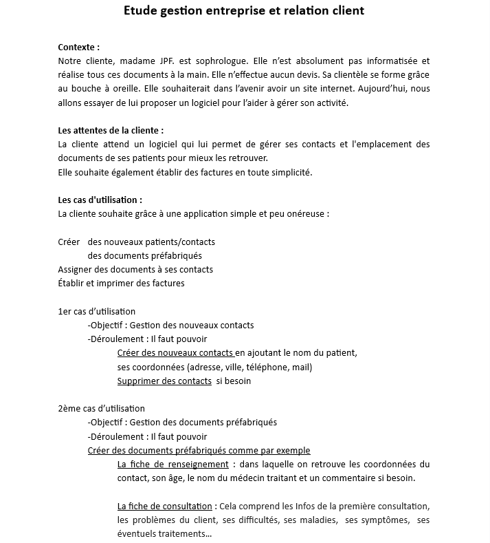
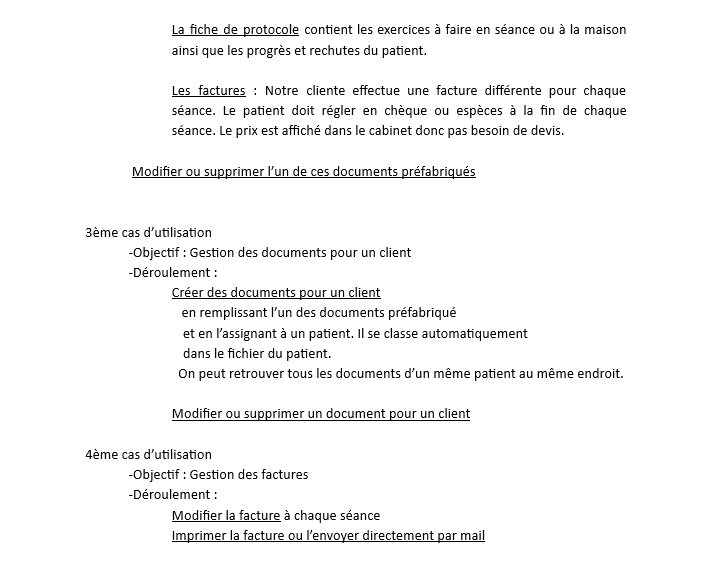
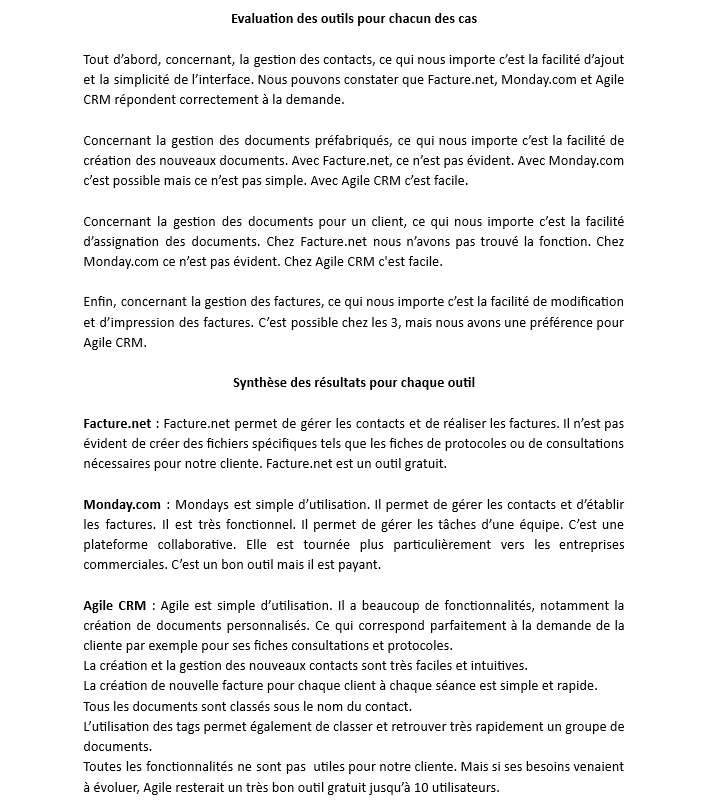
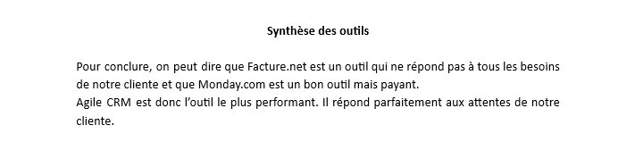
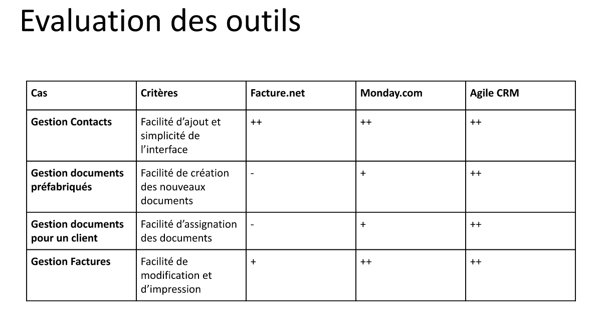
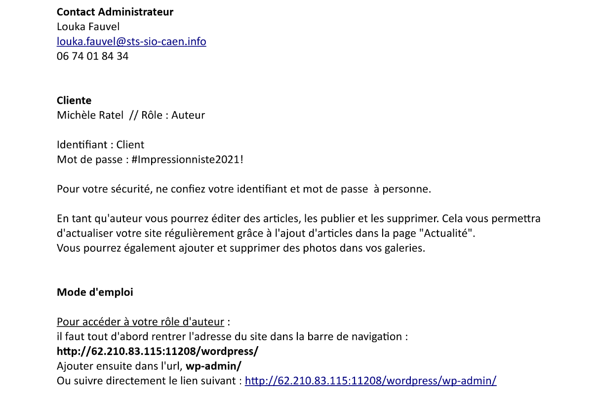
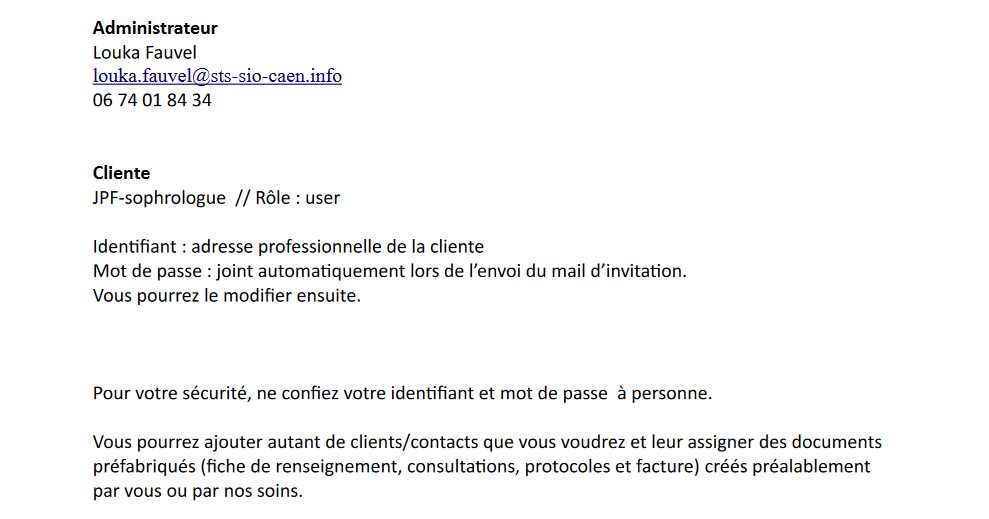
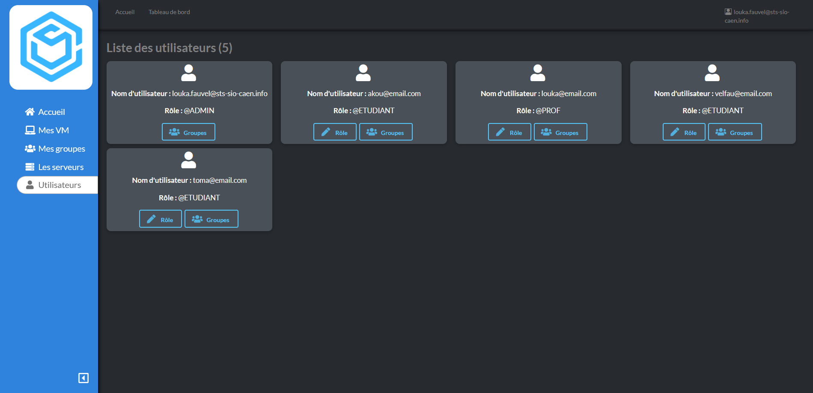
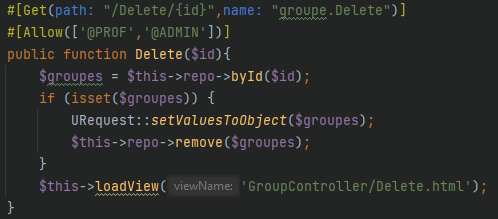
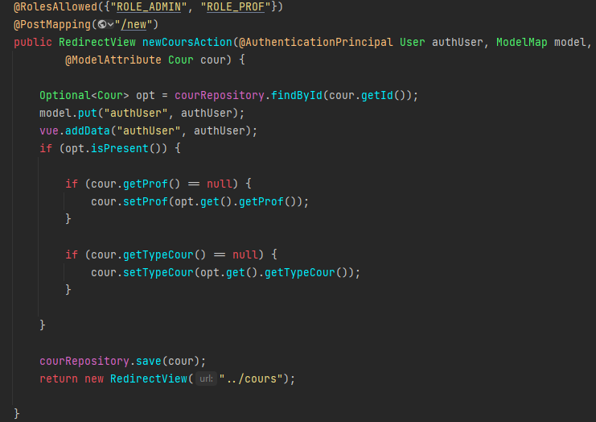

# [A 1.1] Gestion du patrimoine informatique

---
## Recensement et identification des ressources numériques

---

### CRM

Madame JPF, sophrologue, n’est pas informatisée et elle 
réalise tous ses documents à la main. 
J'ai essayé de lui proposer un logiciel pour l’aider à gérer son activité.

La cliente souhaitait un logiciel facile d'utilisation, gratuit, 
qui lui permettrait de gérer ses contacts et l'emplacement
des documents de ses patients pour mieux les retrouver. 
Elle souhaitait également établir des factures en toute simplicité.

J'ai donc réalisé une étude des besoins de la cliente 
et des différents logiciels. 

Cela m'a permis de choisir un CRM adapté aux besoins de ma cliente : Agile CRM.

### Stage chez Fime

Lors de ma première semaine de stage chez Fime, j'ai étudié le site de 
l'entreprise en anglais afin de bien comprendre les missions de l'entreprise 
et identifier ses ressources numériques.
Mission principale : sécurisation des moyens de paiement.
Il y a deux pôles distincts dans le bâtiment :
- Développement : sites et logiciels
- Labo : où sont réalisés les tests et expériences 
(ex : ouverture avec pass des portes, résistance de la carte aux chocs 
thermiques, passage de la carte bleue sur un terminal de paiement...)

J'ai également revu le langage Python et le framework Angular avec 
le langage Typescript afin de maitriser les outils de l'entreprise. 

---
## Exploitation des référentiels, normes et standards adoptés par le prestataire informatique

---

### Refonte-Site-Artiste

Utilisation de WordPress. 

### CRM

Utilisation d'Agile CRM.

### Stage chez Altilog

Utilisation de Webdev 25 et 27.

---
## Mise en place et vérification des niveaux d’habilitation associés à un service

---
Afin de sécuriser les sites ou les applications, 
j'ai mis en place un système de rôles qui permet la vérification 
des niveaux d'habilitation des utilisateurs à un service. 

### Refonte-Site-Artiste

Mise en place des rôles :
- admin : Je peux modifier la structure du site. 
- auteur : L'artiste peut modifier certains articles ou ajouter des photos
sur son site par contre elle ne peut pas rajouter de page ni modifier 
la structure du site.

### CRM

Mise en place des rôles :
- admin : Je peux modifier la structure du CRM et créer des documents préfabriqués comme 
(fiche de renseignements, consultations, protocoles et factures).
- user : La cliente peut ajouter des clients,
assigner des documents préfabriqués (fiche de renseignements,
consultations, protocoles et factures).

### Proxmox-admin

Mise en place des rôles : 
- @ADMIN :
  - Gérer les serveurs

- @PROF :
  - Gérer des utilisateurs
  - Gérer des groupes
  - Gérer les droits des utilisateurs ou groupes sur les ressources 
  (VM ou serveurs)
  - Consulter la liste des serveurs auxquels je peux accéder
  - Me connecter à un serveur proxmox
  - Lister les VMs d’un serveur
  - Gérer les routes
  - Gérer les DNS
  - Me déconnecter d’un serveur proxmox

- @ETUDIANT :
  - Accéder à mon tableau de bord
  - Lister mes VMs
  - Lister mes groupes
  - Créer/modifier une VM
  - Modifier les propriétés de base d’une VM
  - Affecter un étudiant à une VM
  - Affecter un groupe à une VM
  - Gérer les services
  - Me déconnecter

### Stage chez Altilog

Mise en place d'une sécurité : si le compte utilisateur 
est suspendu de la base de données, il ne peut pas se connecter.

### E-music

Mise en place des rôles :
- ROLE_ADMIN : 
  - Créer un cours
  - Planifier un cours
  - Annuler une séance de cours
  - Lister les cours
  - Consulter la liste des élèves d'un cours
  - Consulter son planning de cours
  - Consulter le détail d'un cours (nb d'élèves...)
  - Modifier un cours 
  - Consulter la liste des membres (parents, enfants, profs)
  - Création de compte pour un membre (au tél par exemple, ou celui d'un prof)
  - Supprimer un compte
  - Suspendre un compte
  - Modifier les informations relatives à un compte
  - Gérer les cours (Création, modification, suppression)
  - Consulter la liste des factures par période, ou pour un cours
  - Consulter la liste des paiements par période, ou pour un cours
  - Enregistrer les paiements effectués par famille
  - Accéder à mon tableau de bord
- ROLE_PROF :
  - Créer un cours
  - Planifier un cours
  - Annuler une séance de cours
  - Lister les cours
  - Consulter la liste des élèves d'un cours
  - Consulter son planning de cours
  - Consulter le détail d'un cours (nb d'élèves...)
  - Modifier un cours
  - Accéder à mon tableau de bord
- ROLE_PARENT :
  - Ajouter son enfant
  - Supprimer son compte
  - Modifier ses informations personnelles
  - Inscrire mon enfant ou moi même à un cours
  - Consulter la liste des cours
  - Modifier mes informations de paiement
  - Lister des inscriptions de ma famille
  - Consulter une inscription à un cours
  - Retirer un membre de ma famille
  - Modifier les informations de mes enfants
  - Consulter ses factures
  - Consulter la planification pour un ou des cours
  - Accéder à ma page d'accueil
- ROLE_ELEVE
  - Modifier ses informations personnelles
  - Consulter la liste des cours
  - Consulter la planification pour un ou des cours
  - Accéder à ma page d'accueil

