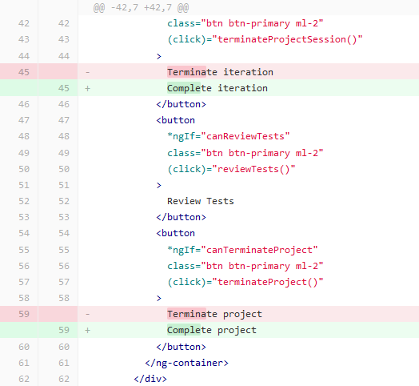

# [A 1.2] Réponse aux incidents et aux demandes d'assistance et d'évolution

---

## Traitement des demandes concernant les applications

---

### CRM

Madame JPF, sophrologue, n'est pas informatisée et elle
réalise tous ses documents à la main.

La cliente souhaitait un logiciel facile d'utilisation, gratuit,
qui lui permettrait de gérer ses contacts et l'emplacement
des documents de ses patients pour mieux les retrouver.
Elle souhaitait également établir des factures en toute simplicité.

J'ai donc réalisé une étude des besoins de la cliente
et des différents logiciels.
J'ai choisi pour l'aider à gérer son activité, un CRM adapté à 
ses besoins : Agile CRM.
Je lui ai créé tous ses documents préfabriqués en tenant compte 
de son cahier des charges. 
Elle utilise depuis ce logiciel et en cas de besoin, je reste à 
sa disposition.
Elle m'a déjà demandé de modifier un élément concernant les factures :
- adresse
- ville

J'ai ainsi apporté une évolution à son application. 

Première version de la facture.

Nouvelle version de la facture.

### Stage chez Altilog

Lors de mon stage, mon tuteur a présenté à une cliente la maquette 
de mon projet concernant son site internet en respectant la charte 
graphique fournie par la cliente.
J'ai ensuite répondu aux demandes et retours de la cliente :
- en corrigeant les erreurs d'affichages liées au bouton pop-up qui permet
de choisir les informations contenues dans une image. 
- J'ai ajouté un autre bouton pop-up pour signaler une anomalie.
- J'ai ajouté un troisième pop-up pour permettre aux informations de changer
selon si on appuie sur supprimer ou modifier. Le message doit apparaître 
si le ou les fichiers sélectionnés sont marqués comme “non modifiable”. 
C'est un pop-up d'avertissement indiquant que la personne ne dispose pas 
des droits requis.
- J'ai ajouté une donnée de test pour tester l'affichage. 
J'ai modifié des icônes pour faire de la diversification en utilisant 
un logiciel de dessin.
- J'ai mis en place une option. Quand on sélectionne une ou plusieurs photos 
et que l'on appuie sur le bouton “Modifier”, les photos apparaissent
dans la liste. Si une photo est catégorisée comme “Non modifiable”. 
La liste se videra automatiquement et un pop-up apparaîtra pour
prévenir qu'il y a une ou plusieurs photos qui sont “Non modifiable”. 
- J'ai ajouté des conditions sur le survol des photos. Si la souris ne 
survole pas la photo, aucun champ n'apparaîtra sauf la photo. 
Si la souris la survole, alors les champs apparaîtront. Si la photo
est considérée comme “Non modifiable”, alors le champ qui affiche ces 
deux mots apparaîtra en dehors du survol.

### Stage chez Fime

**Projet :** 1

**Mission :** 1 (Frontend)

**Objectif :** Affichage date

J'ai commencé à travailler sur le premier projet en frontend. 
J'ai changé l'affichage du format de la date en ajoutant les heures, 
les minutes et les secondes en utilisant le DatePipe du framework Angular. 
Ensuite, j'ai modifié la position de la balise qui contient 
la date en enlevant et ajoutant des actions dans la classe qui correspond 
à la balise.

**Projet :** 2

**Mission :** 1 (Frontend)

**Objectif :** modification de deux boutons

**Projet :** 2

**Mission :** 2 (Frontend et Backend)

**Objectif :** modification d'un formulaire

<u>Frontend</u> :

Modification d'un formulaire en ajoutant un nouveau champ 
(adresse de l'entreprise) et en fusionnant deux autres champs en 
un (prénom et nom).
J'ai ajouté des messages de validation pour les nouveaux champs en 
cas d'erreur.

J'ai ajouté une fonction qui va préparer le format d'affichage pour 
l'adresse de l'entreprise.

<u>Backend</u> :

Suite à des tests d'un développeur pour la création d'un template, 
j'ai modifié toutes les informations qui concernent le prénom et le nom 
dans le backend. Dans le champ qui affiche normalement l'adresse de 
l'entreprise, j'ai affiché le nom de l'entreprise. J'ai retrouvé l'adresse 
de l'entreprise dans le backend. Je l'ai renvoyée sous forme de 
liste JSON dans le frontend.

J'ai modifié le renvoie de l'adresse de l'entreprise.
Avant, l'objet avait quatre entrées pour ranger les données de 
l'adresse de l'entreprise, mais la liste pourrait être plus grande que 
quatre. Alors maintenant, l'objet a une entrée qui contient une liste 
sans aucune limite de taille. J'ai ajouté l'adresse de l'entreprise 
dans tous les templates.

**Projet :** 2

**Mission :** 3 (Frontend et Backend)

**Objectif :** Ajouter une nouvelle itération dans un projet fermé 
grâce à un nouveau bouton

<u>Frontend</u> :

Le projet peut contenir une liste de projets dont chaque projet peut 
contenir une ou plusieurs itérations. L'objectif est de pouvoir ajouter 
une nouvelle itération dans un projet fermé. Je dois ajouter un bouton 
qui permet de changer le statut du projet pour qu'il ne soit plus fermé et 
ajouter une nouvelle itération. 

J'ai ajouté des restrictions pour pouvoir faire afficher le bouton 
de réouverture du projet pour être sûr de ne pas y avoir accès 
si le projet est ouvert.

J'ai reçu un problème de la part d'un développeur qui m'indique que quand 
on appuie sur le bouton de réouverture du projet, le bouton de fermeture 
du projet réapparaît pendant un lapse de temps avant de disparaître 
à nouveau. Pour pallier ce problème, j'ai ajouté une variable booléenne 
globale qui est définie sur false de base pour savoir si le projet est 
rouvert. La variable globale est mise à jour à chaque fois que 
l'utilisateur appuie sur le bouton pour fermer ou pour rouvrir le projet.
Dans le système qui restreint l'affichage du bouton de fermeture, 
j'ai ajouté une nouvelle fonction qui vérifie bien que la variable globale 
est false.

J'ai reçu un problème de la part d'un développeur qui m'indique que 
le projet ne pouvait pas être rouvert deux fois de suite car le bouton 
de fermeture ne s'affichait pas sur le deuxième essai.
J'ai ajouté la variable booléenne globale qui est définie sur false 
à la fin de la fonction de réouverture. J'ai par la suite découvert 
que le bouton de réouverture ne s'affichait pas quand l'une itération 
avait été rejetée et que le projet avait été fermé. J'ai ajouté une 
autorisation pour que le bouton s'affiche si l'itération est rejetée.

<u>Backend</u> :

J'ai ajouté une nouvelle fonction sur le back-end pour pouvoir modifier 
le statut du projet de manière spécifique.
J'ai ajouté une nouvelle variable de type enum qui est “RE_OPENED” 
pour le statut.

**Projet :** 2

**Mission :** 4 (Frontend)

**Objectif :** Modifier l'affichage de l'heure sur un commentaire envoyé

J'ai modifié la manière d'afficher la date et heure sur 
un commentaire envoyé. Auparavant s'affichait depuis combien de temps 
le commentaire avait été envoyé et maintenant, c'est la date et l'heure 
précise de l'envoi qui s'affiche.

J'ai fait le nettoyage sur les imports inutilisés.

**Projet :** 2

**Mission :** 5 (Frontend et Backend)

**Objectif :** Ajouter le nom de l'entreprise lors d'un commentaire

<u>Frontend</u> :

J'ai ajouté le nom de l'entreprise derrière le prénom de la personne 
qui envoie un commentaire. 

Un développeur m'a informé que le nom de l'entreprise s'affichait en lien 
avec le projet et non avec l'utilisateur. Suite à ça, j'ai ajouté 
une vérification qui trie tous les utilisateurs en fonction 
du prénom et du nom. Il fait correspondre l'auteur du commentaire 
au nom de l'entreprise et l'affiche.

J'ai ajouté le nom de l'entreprise dans le modèle du commentaire.
Par la suite, j'ai supprimé la fonctionnalité précédente qui est obsolète.

<u>Backend</u> :

J'ai modifié l'objet des commentaires pour retourner en plus le nom de 
l'entreprise de l'utilisateur. La méthode de vérification que 
j'avais créée dans le frontend était trop lourde. 
Il pouvait y avoir aussi des problèmes d'identité. Le commentaire pouvait 
s'afficher plusieurs fois si des utilisateurs avaient le même nom.