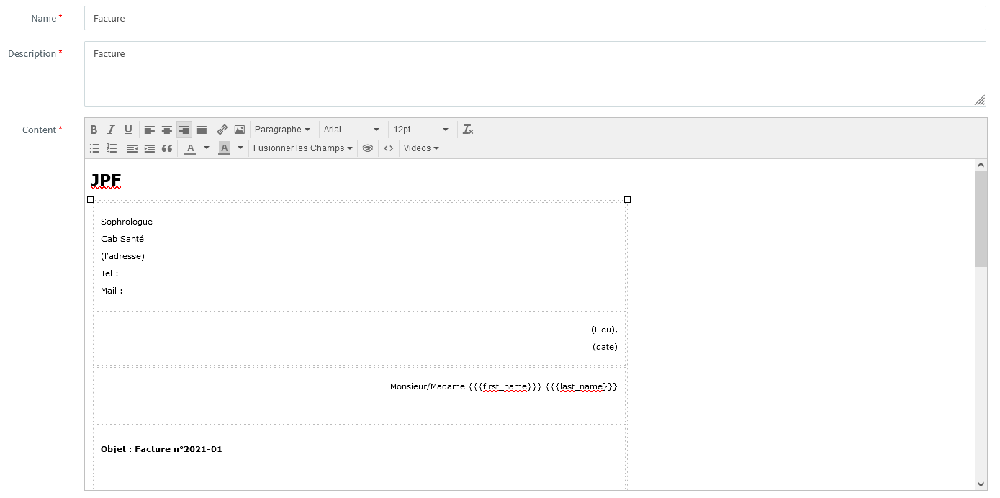
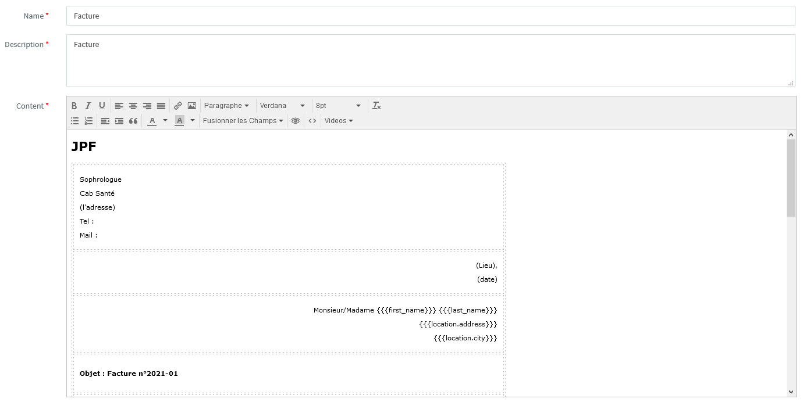

# [A 1.2] Réponse aux incidents et aux demandes d’assistance et d’évolution

---

## Traitement des demandes concernant les applications

---

### CRM

Madame JPF, sophrologue, n’est pas informatisée et elle
réalise tous ses documents à la main.

La cliente souhaitait un logiciel facile d'utilisation, gratuit,
qui lui permettrait de gérer ses contacts et l'emplacement
des documents de ses patients pour mieux les retrouver.
Elle souhaitait également établir des factures en toute simplicité.

J'ai donc réalisé une étude des besoins de la cliente
et des différents logiciels.
J'ai choisi pour l’aider à gérer son activité, un CRM adapté à 
ses besoins : Agile CRM.
Je lui ai créé tous ses documents préfabriqués en tenant compte 
de son cahier des charges. 
Elle utilise depuis ce logiciel et en cas de besoin, je reste à 
sa disposition.
Elle m’a déjà demandé de modifier un élément concernant les factures :
- adresse
- ville

J'ai ainsi apporté une évolution à son application. 

Première version de la facture.

Nouvelle version de la facture.

### Stage chez Altilog

Lors de mon stage, mon tuteur a présenté à une cliente la maquette 
de mon projet concernant son site internet en respectant la charte 
graphique fournie par la cliente.
J’ai ensuite répondu aux demandes et retours de la cliente :
- en corrigeant les erreurs d'affichages liées au bouton pop-up qui permet
de choisir les informations contenues dans une image. 
- J'ai ajouté un autre bouton pop-up pour signaler une anomalie.
- J’ai ajouté un troisième pop-up pour permettre aux informations de changer
selon si on appuie sur supprimer ou modifier. Le message doit apparaître 
si le ou les fichiers sélectionnés sont marqués comme “non modifiable”. 
C’est un pop-up d’avertissement indiquant que la personne ne dispose pas 
des droits requis.
- J’ai ajouté une donnée de test pour tester l’affichage. 
J’ai modifié des icônes pour faire de la diversification en utilisant 
un logiciel de dessin.
- J’ai mis en place une option. Quand on sélectionne une ou plusieurs photos 
et que l'on appuie sur le bouton “Modifier”, les photos apparaissent
dans la liste. Si une photo est catégorisée comme “Non modifiable”. 
La liste se videra automatiquement et un pop-up apparaîtra pour
prévenir qu’il y a une ou plusieurs photos qui sont “Non modifiable”. 
- J’ai ajouté des conditions sur le survol des photos. Si la souris ne 
survole pas la photo, aucun champ n’apparaîtra sauf la photo. 
Si la souris la survole, alors les champs apparaîtront. Si la photo
est considérée comme “Non modifiable”, alors le champ qui affiche ces 
deux mots apparaîtra en dehors du survol.