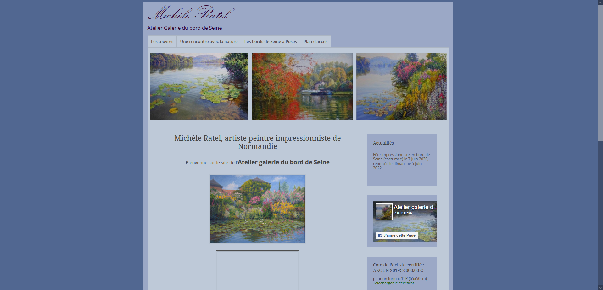

# [A 1.3] Développement de la présence en ligne de l’organisation

---
## Participation à l’évolution d’un site Web exploitant les données de l’organisation

---
### Refonte Site Artiste

J'ai, en première année de BTS SIO, amélioré le [site](https://www.mratel.fr/) 
de Michèle Ratel.

#### Finalités du site de l'artiste

L’objectif principal de ce site est de promouvoir les œuvres d’une artiste et de faire
découvrir son histoire personnelle.
L’un des objectifs complémentaires est de communiquer sur ses expositions à venir.
Il est également important de rendre accessible son atelier, ouvert à la visite et de rendre
visible les œuvres de l’artiste, disponibles à la vente.
Les utilisateurs du site pourront suivre l’artiste grâce à ses actualités. Ils pourront
enfin contacter l’artiste par le biais d’un formulaire de contact et lui laisser un
commentaire qui s’ajoutera dans le livre d’or après validation de l’artiste.

#### Etude du site de l'artiste avant refonte

<u>Atouts</u> : 
Le site dispose de contenus complets et de qualité.

<u>Inconvénients</u> : 

- La structuration dans les différents onglets du menu
- La charte graphique, pas assez moderne
- Les RGPD et mentions légales (qui ne sont pas présents)
- Le formulaire de contact pas assez visible (dans le livre d’or) 
- Pas de captcha
- Le site ne semble pas à jour car le copyright est de 2017

#### Modifications apportées

J'ai réalisé ce projet sous **WordPress**, en utilisant comme thème : **NatureSpace** 
et comme plugins : **WPForms Lite** et **Envira Gallery**.

<u>Aspects esthétiques</u> :
- Thème choisi : NatureSpace. Ce thème est en adéquation avec la
nature, thème développé par l’artiste dans ses peintures.

<u>Aspects ergonomiques et structurels</u> :

J'ai fait en sorte que la barre de navigation suive sur toutes les pages. 
J'ai réagencé les pages afin de faciliter la navigation du visiteur et lui 
permettre de trouver plus rapidement ce qu'il cherche. 

- Menu de navigation : 
  - Accueil
  - Biographie
  - Galerie
    - Tableaux réalisés
    - Tableaux exposés
  - Atelier 
  - Actualités
  - Contact

- Accueil : Réalisation d'une page originale illustrée avec des peintures 
de l’artiste.

- Biographie : Mise en place d'une photo de l’artiste.

- Galerie : Mise en avant de toutes ses peintures avec leurs formats si 
disponibles.

- Atelier : Ajout d'une carte ainsi que des photos de l’atelier et 
des trois salles d’expositions.

- Actualités : Mise en place d'une page de d'actualité modifiable pour 
l’artiste grâce à des articles. Grâce au document client, Michèle Ratel 
peut facilement mettre à jour son site et ses événements. 

- Contact : Mise en place d'un formulaire de contact avec un captcha.
Ajout d'un lien facebook afin qu’il soit visible sur chaque page, 
ainsi que le RGPD en bas de page.

### Stage Chez Altilog

J'ai, lors de mon stage chez Altilog, 
participé à l'évolution du site d'un client afin de rendre
plus agréable l'expérience utilisateur.
J'ai modifié l'apparence visuelle de certains boutons de l'interface et
j'ai modifié le z-index d'une image qui affiche un loading.
Pour des raisons de confidentialité, je n'ai pas d'image.