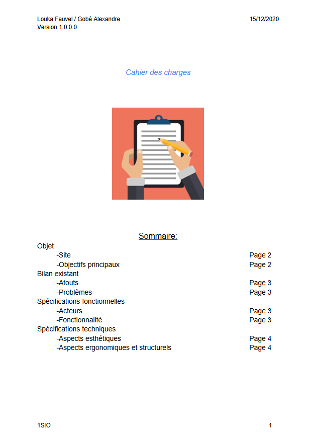
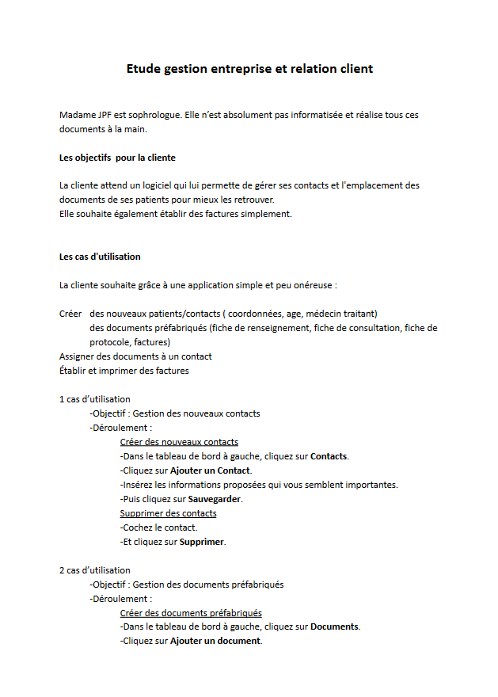
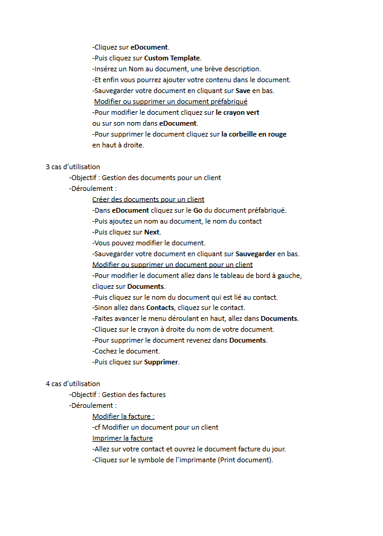
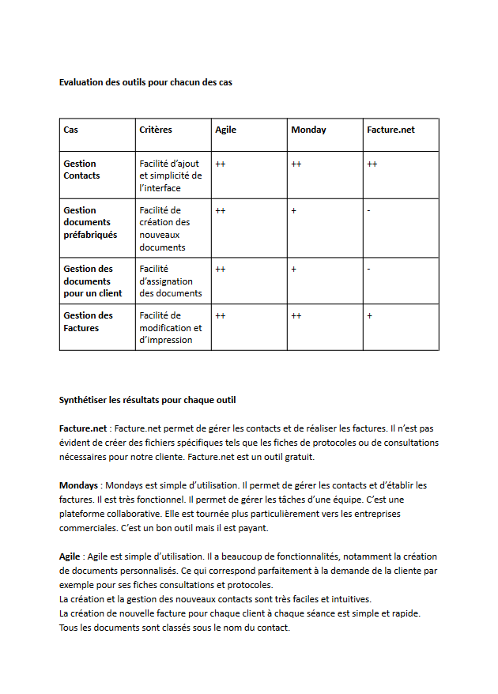
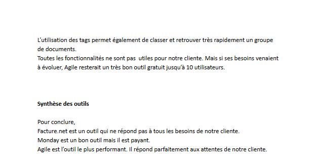
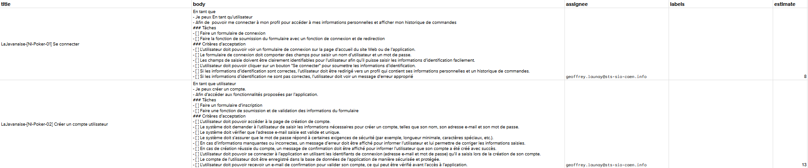
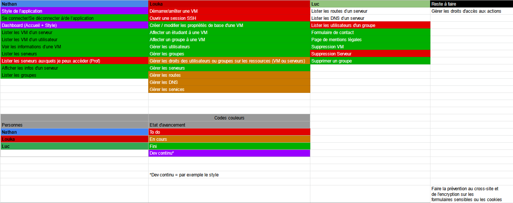
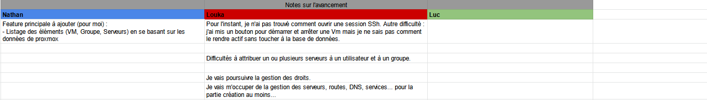
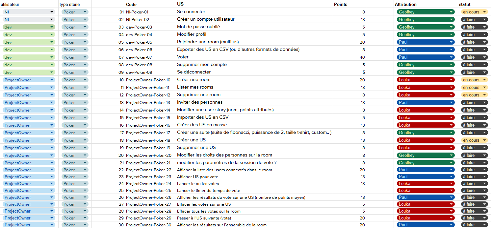
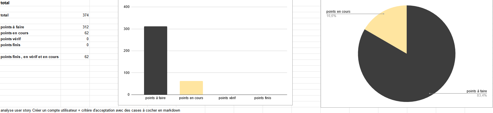

# [A 1.4] Travail en mode projet

---
## Analyse des objectifs et des modalités d'organisation d’un projet

---
### Refonte-Site-Artiste
Nous avons rédigé [le cahier des charges](https://github.com/Louka-Fauvel/Refonte-Site-Artiste/blob/master/document/Cahier-des-charges.pdf) 
après avoir analysé les atouts et les défauts du site d'un point de vue 
esthétique et structurel.

### CRM
J'ai rédigé une étude après avoir analysé les besoins de la cliente et
recensé les resources de CRM à notre disposition.

### PlanitPoker
Suite à un échange oral, nous avons collectivement analysé 
les besoins de l'application et nous avons rédigé l'ensemble des US.

---
## Planification des activités

Travailler en équipe nécessite de s'organiser et de communiquer.

---
### Tableau de planification sur un fichier excel

#### E-music

Nous avons construit un tableau excel pour organiser les tâches 
et nous les avons réparties en fonction de leur importance et difficulté.

Ce tableau affiche donc : 
- Le code et le libellé de la tâche à faire
- Le point d'histoire (niveau d'importance de la tâche)
- Le nom du responsable de la tâche
- Un code couleur en fonction de l'avancement de la réalisation de la tâche 
  - Noir pour _à faire_
  - Jaune pour _en cours_
  - Bleu pour _en vérification_ 
  - Vert pour _finie_
- Le niveau de disponibilité, d'intégrité, de confidentialité
  et de preuve.

<u>Avantages</u> : On pouvait voir en temps presque réel l'avancé des autres 
et du projet dans son ensemble. 

<u>Difficultés rencontrées</u> : Ce tableau nous a permis de nous rendre 
compte d'une mauvaise répartition des tâches au départ. 
Nous étions parfois obligés d'attendre que l'autre est fait sa fonction 
pour raccorder la nôtre. Il y a eu une perte de temps de mon point de vue. 
Il aurait fallu rectifier en cours de projet mais cela n'a pas été fait. 

#### Proxmox-admin

Nous avons construit un tableau pour se répartir les tâches avec
des codes couleurs : 
- Rouge _to do_
- Orange _en cours_
- Vert _fini_
- Violet _dev continu_

Nous avions également un tableau pour noter nos avancements et
les difficultés que nous pouvions rencontrer afin de nous entraider.
En prenant connaissance des bugs des autres nous pouvions 
intervenir plus rapidement. Nous pouvions également demander de l'aide 
par Discord mais l'intérêt de ce tableau est qu'il reste une trace 
visible de nos besoins. 

<u>Exemples de difficultés</u> : ouvrir une session SSh, démarrer et arrêter un VM...

<u>Exemple d'entraide</u> : J'avais dans le tableau excel proposé de 
faire une nouvelle tâche. Mon camarade a répondu via Discord à 
ma proposition. Nous avons ainsi gagné du temps. 

#### PlanitPoker
Nous avons construit un tableau excel pour organiser et répartir les tâches.

Tableau planification excel PlanitPoker

Tableau de suivi des réalisations

### Tableau de planification sur Github

#### E-music

Nous avons organisé le travail sur Github en créant des issues. 
Nous avons utilisé l'addon ZenHub pour savoir si l'issue est 
- _à faire_
- _en cours_
- _en vérification_ 
- _fini_

Ce tableau en plus de rendre visuel l'avancement du projet, 
il permet de connaître facilement les critères d'acception contenus 
dans les issues. On peut ainsi se réinterroger à chaque fois pour savoir 
si on a bien réalisé ce qui est attendu. 

#### Proxmox-admin

Nous avons organisé le travail sur Github en créant des issues. 
Nous avons utilisé l'addon ZenHub pour savoir si l'issue est 
- _To do_
- _In Progress_ 
- _Done_

Nous n'avions pas inscrit de critères d'acceptation. 

