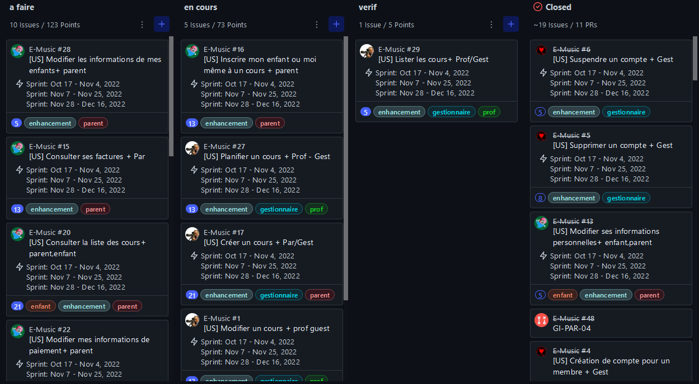

# [A 1.4] Travail en mode projet

---
## Planification des activités

---
### Tableau de planification sur un fichier excel

#### E-music

J'ai avec mon groupe, construit un tableau pour organiser les idées.
Il affiche le titre des tâches à faire,
le niveau d'importance des tâches, à qui est attribué la tâche,
si la tâche est _à faire_, _en cours_, _en vérification_ ou _finie_.
Il affiche le niveau de disponibilité, d'intégrité, de confidentialité
et de preuve.

#### Proxmox-admin

J'ai avec mon groupe, construit un tableau pour se répartir les tâches avec
des codes couleurs (rouge to do, orange en cours, vert fini et en
violet dev continu)

Nous avions également un tableau pour noter nos avancements et
les difficultés que nous pouvions rencontrer afin de nous entraider.

### Tableau de planification sur Github

#### E-music

Avec mon groupe, nous avons organisé le travail 
sur Github en créant des issues. Nous avons utilisé l'addon 
ZenHub pour savoir si l'issue est 
_à faire_, _en cours_, _en vérification_ ou _fini_.

#### Proxmox-admin

Avec mon groupe, nous avons organisé le travail, 
sur Github en créant des issues. Nous avons utilisé l'addon 
ZenHub pour savoir si l'issue est _To do_, _In Progress_ ou _Done_.

