# [A 1.5] Mise à disposition des utilisateurs d'un service informatique

---
## Test d'intégration et d'acceptation d'un service

---
### Stage chez Fime
Lors de mon stage, après chaque évolution apportée au projet, j'ai réalisé
des tests pour vérifier que ces nouvelles fonctionnalités n'avaient
pas d'erreur.

Les tests sont effectués avec Pipeline, un outil qui permet de réaliser
automatiquement des tests unitaires.
Malheureusement Pipeline ne marchait pas correctement en locale
sur ma machine.
J'ai donc fait les tests avec Pipeline dans l'espace (Gitlab) où est stocké
le projet. Pipeline est intégré par défaut dans chaque repository (projet)
de l'entreprise.
Chaque branche est reliée à un pull request.
À chaque fois qu'une branche est mise à jour, Pipeline fait les tests
automatiquement :

- Build
- Test
- Deploy
- Production

Cela permet de faire une intégration continue
des différentes versions d'une solution applicative.

Exemples de Tests

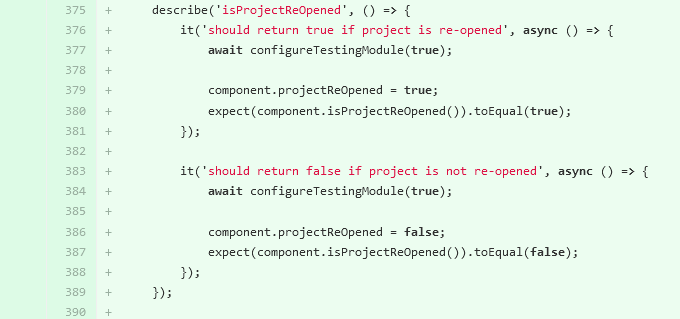
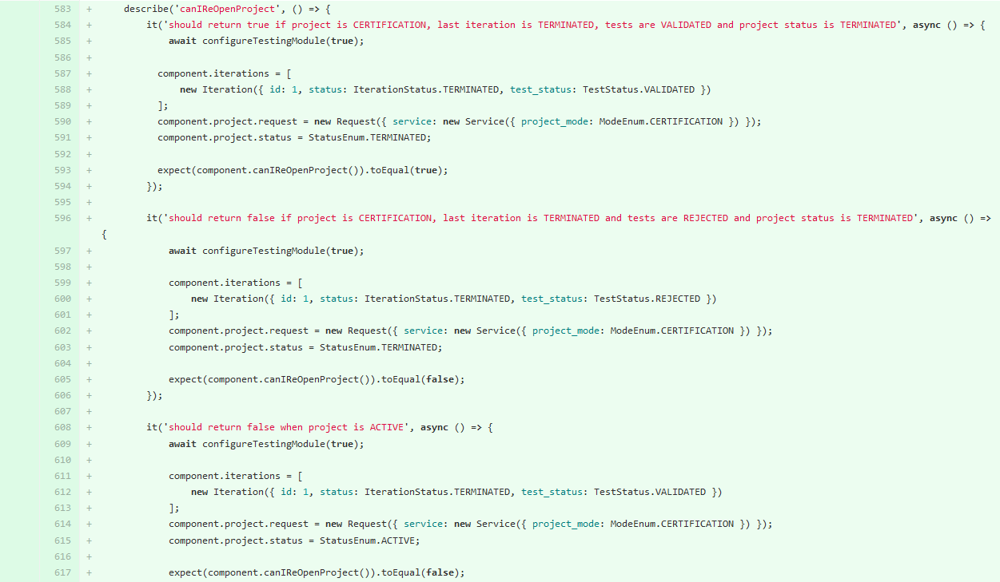
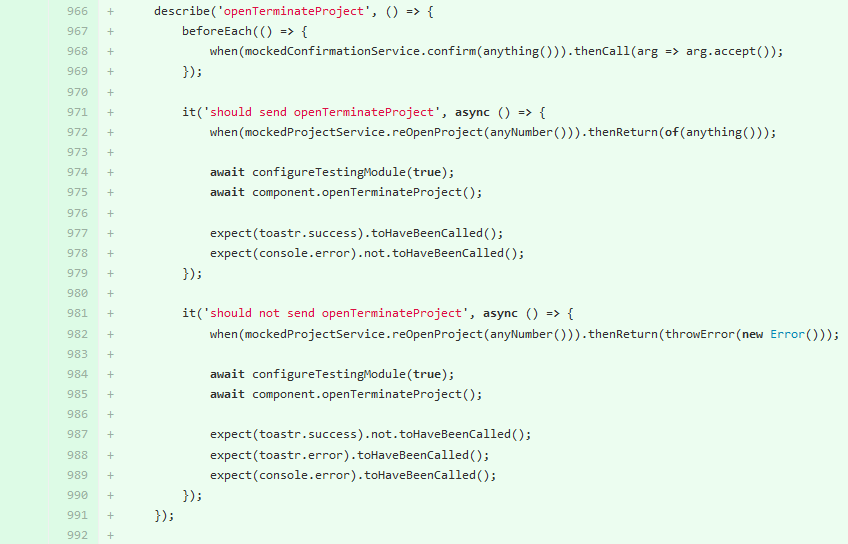

### E-music
Sur le projet E-music, j'ai commencé à réaliser des tests d'intégration
avec Mockito (framework de test open source pour Java) et SpringBootTest.
Mes tests ne sont malheureusement pas encore très concluants.

---
## Déploiement d'un service

---
### CRM
Madame JPF est sophrologue. Elle n'est absolument pas informatisée et
réalise tous ses documents à la main. Elle n'effectue aucun devis.
Sa clientèle se forme grâce au bouche à oreille.
Elle souhaitait dans un futur proche avoir un site internet.
J'ai essayé de lui proposer un logiciel pour l'aider à gérer
son activité.

La cliente attendait un logiciel qui lui permettrait de gérer ses contacts et
l'emplacement des documents de ses patients pour mieux les retrouver.
Elle souhaitait également établir des factures en toute simplicité.

Après une étude des besoins de la cliente et des différents logiciels,
je lui ai préparé un CRM avec Agile CRM.

#### Les cas d'utilisation
La cliente souhaite grâce à une application simple et peu onéreuse :

- Créer des nouveaux patients/contacts et des documents préfabriqués

- Assigner des documents à ses contacts

- Établir et imprimer des factures

**1er cas d'utilisation**

- <u>Objectif</u> : Gestion des nouveaux contacts
- <u>Déroulement</u> :
  - <u>Créer des nouveaux contacts</u> : en ajoutant le nom du patient, 
  ses coordonnées (adresse, ville, téléphone, mail)
  - <u>Supprimer des contacts</u> : si besoin

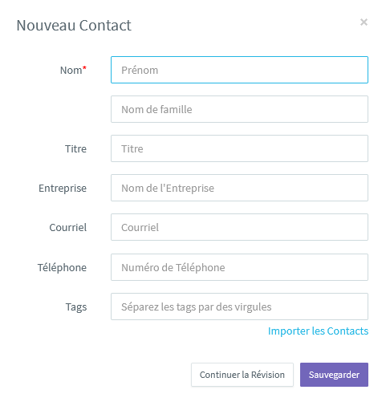 
Créer des nouveaux contacts

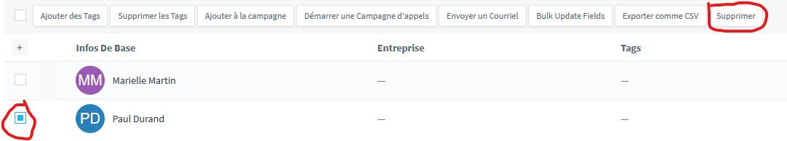 
Supprimer des contacts

**2ème cas d'utilisation**

- <u>Objectif</u> : Gestion des documents préfabriqués
- <u>Déroulement</u> :
  - <u>Créer des documents préfabriqués</u>
    - <u>Fiche de renseignement</u> : on retrouve les coordonnées du contact, 
    son âge, le nom du médecin traitant et un commentaire si besoin.
    - <u>Fiche de consultation</u> : cela comprend les Infos de la première 
    consultation, les problèmes du client, ses difficultés, ses maladies, 
    ses symptômes, ses éventuels traitements...
    - <u>Fiche de protocole</u> : elle contient les exercices à faire 
    en séance ou à la maison ainsi que les progrès et rechutes du patient.
    - <u>Factures</u> : une facture différente pour chaque séance. 
    Le patient doit régler en chèque ou espèces à la fin de chaque séance. 
    Le prix est affiché dans le cabinet donc pas besoin de devis.
  - <u>Modifier ou supprimer un document préfabriqué</u>

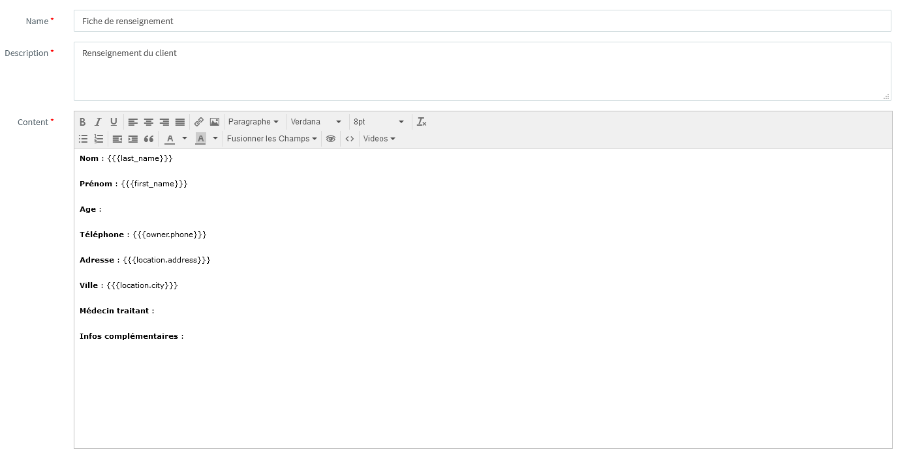
Fiche de renseignement

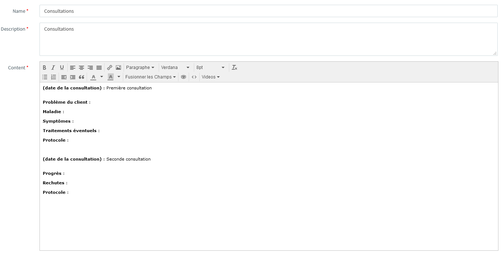
Fiche de consultation

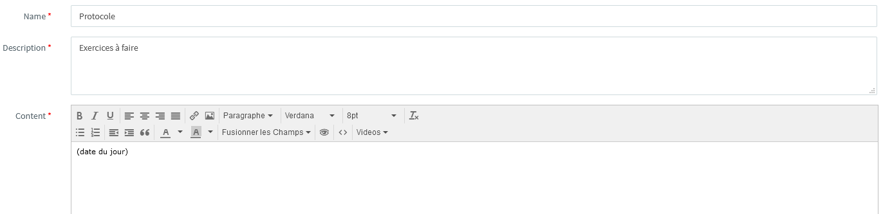
Fiche de protocole

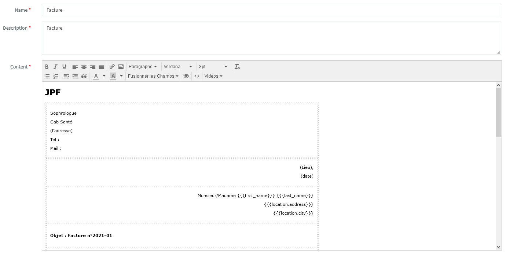
Factures

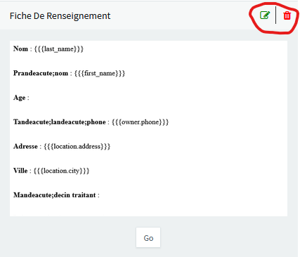 
Modifier ou supprimer un document préfabriqué

**3ème cas d'utilisation**

- <u>Objectif</u> : Gestion des documents pour un client
- <u>Déroulement</u> :
  - <u>Créer des documents pour un client</u> : en remplissant l'un des 
  documents préfabriqués et en l'assignant à un patient. Il se classe 
  automatiquement dans le fichier du patient. On peut retrouver tous 
  les documents d'un même patient au même endroit.
  - <u>Modifier ou supprimer un document pour un client</u>

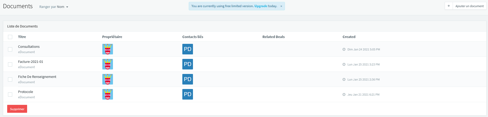

**4ème cas d'utilisation**

- <u>Objectif</u> : Gestion des factures
- <u>Déroulement</u> :
  - <u>Modifier la facture</u> à chaque séance
  - <u>Imprimer la facture ou l'envoyer directement par mail</u>

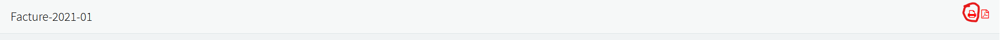

Depuis, la cliente utilise mon service. 
Elle m'a également demandé des évolutions. 

### WebPOO
Réalisation d'un réseau social pour des étudiants.

<u>Cas d'utilisations</u> :

- Créer ou modifier un compte étudiant

- Avoir une photo de profil

- Créer un message à propos de nous

<u>Langages utilisés</u> : HTML, PHP, CSS

<u>Outils utilisés</u> : Bootstrap, Serveur XAMPP

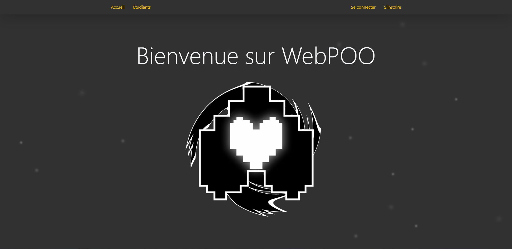
Ce projet n'est pas en ligne. 

---
## Accompagnement des utilisateurs dans la mise en place d'un service

---
### Refonte-Site-Artiste
Réalisation d'une [documentation](https://github.com/Louka-Fauvel/Refonte-Site-Artiste/blob/master/document/Documentation%20Client.pdf) pour faciliter la navigation et 
l'utilisation du site par l'artiste.

Elle contient :
- les contacts administrateur et cliente
- le mode d'emploi :
  - pour accéder au site
  - pour accéder au tableau de bord
  - pour éditer un article
  - pour ajouter ou retirer des photos dans les galeries

[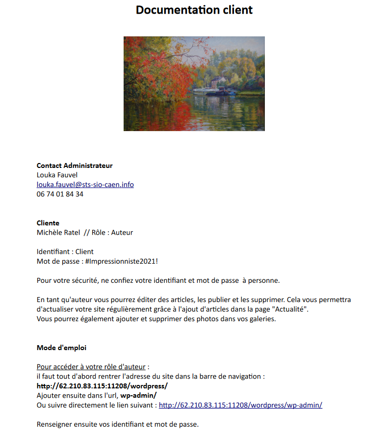](https://github.com/Louka-Fauvel/Refonte-Site-Artiste/blob/master/document/Documentation%20Client.pdf)
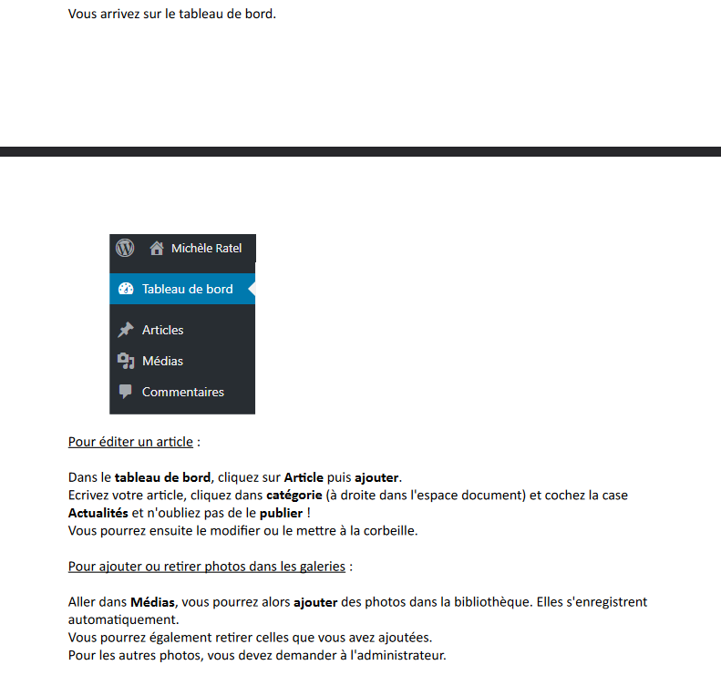

### CRM
Réalisation d'une [documentation](http://www.louka-fauvel.fr/assets/doc/Documentation_Client.pdf) de 9 pages pour faciliter l'expérience utilisateur 
de la cliente.

Elle contient : 
- les contacts administrateur et cliente
- le mode d'emploi :
  - pour accéder au site
  - pour créer ou supprimer un contact
  - pour créer ou document préfabriqué
  - pour créer ou supprimer un document pour un client
  - pour imprimer une facture

[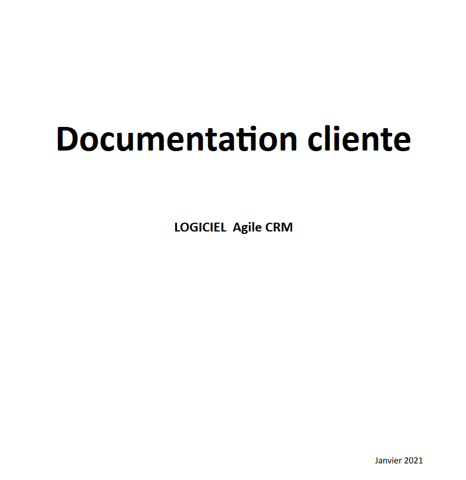](http://www.louka-fauvel.fr/assets/doc/Documentation_Client.pdf)
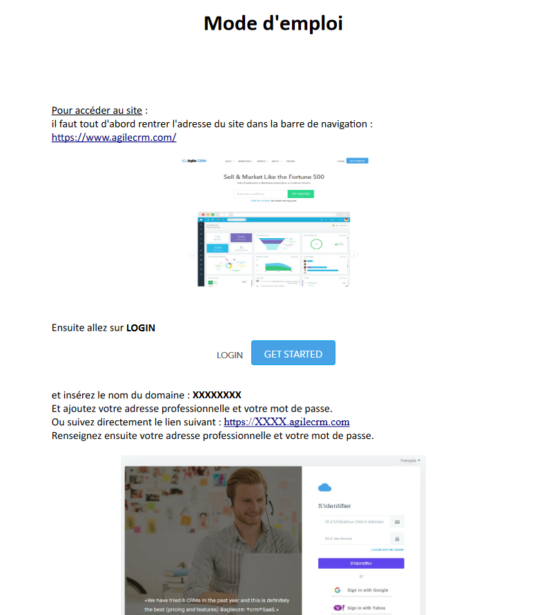

### WebPOO
Réalisation d'un [tuto vidéo](https://www.youtube.com/watch?v=LMfGrRpgTtk) pour améliorer l'expérience utilisateur 
des étudiants.

[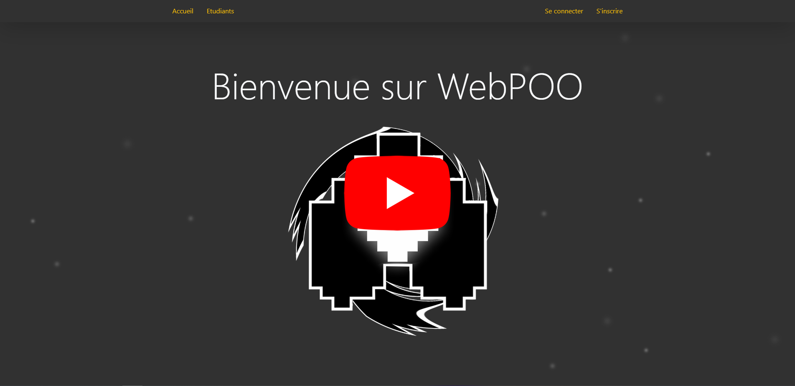](https://www.youtube.com/watch?v=LMfGrRpgTtk)