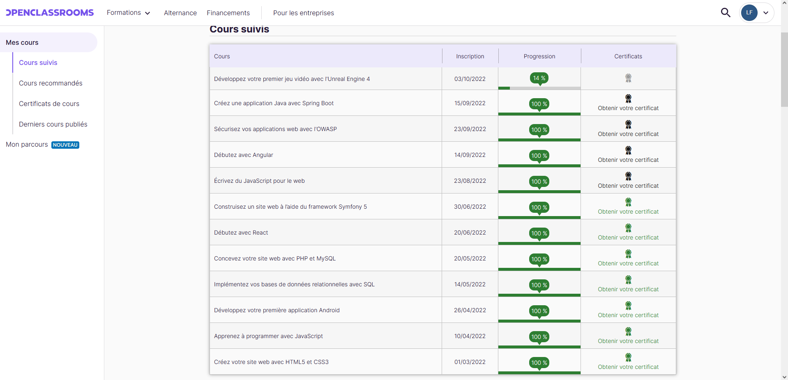
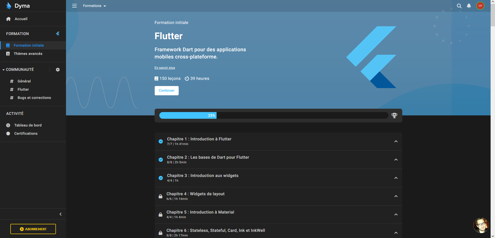
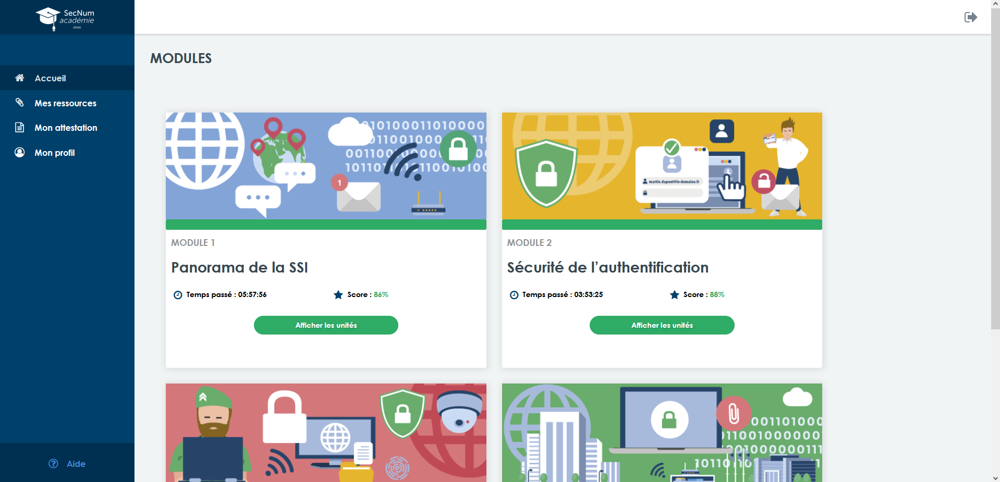
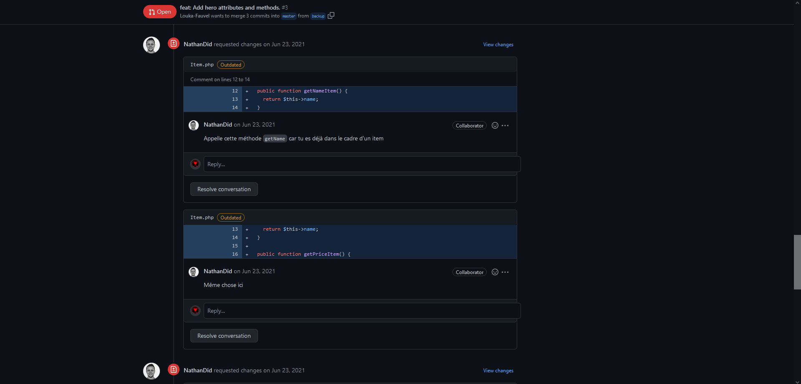
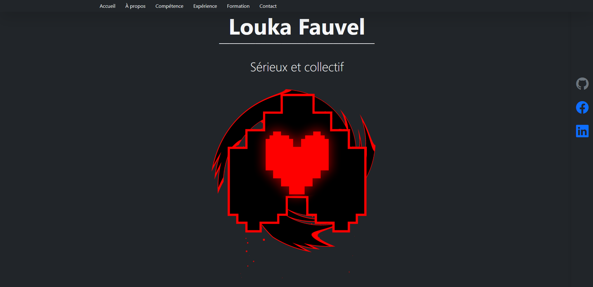
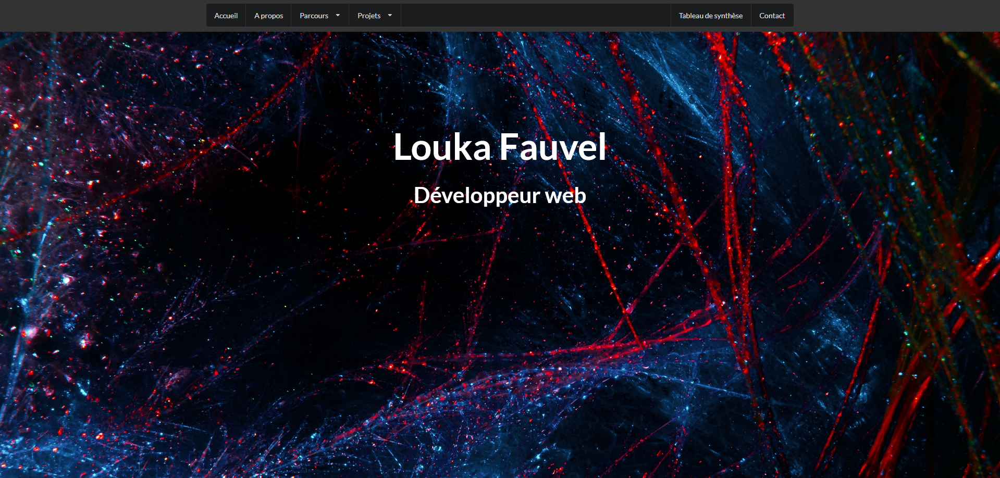
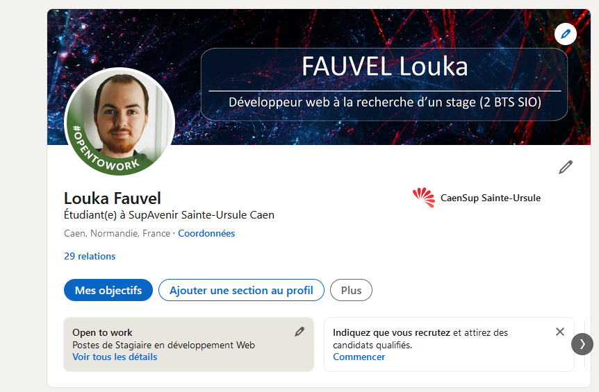

# [A 1.6] Organisation de son développement professionnel

---
## Mise en place de son environnement d’apprentissage personnel

---
J'ai enrichi mes compétences par le biais de certifications. 
### Sites :
- [OpenClassrooms](https://openclassrooms.com/fr/)
- [Dyma](https://dyma.fr/)
- [ANSSI-SecNum académie](https://secnumacademie.gouv.fr/)

### OpenClassrooms

### Dyma

### ANSSI-SecNum académie

### TOEIC

### Stage chez KNPlabs
En fin de première année, j'ai réalisé mon stage chez KNPLabs, 
une agence de développement web située à Caen. 
J'ai tout au long de mon stage fait avec mon tuteur beaucoup d'exercices en PHP afin de 
revoir les fondamentaux de l’objet. 

### Stage chez Altilog
En deuxième année, j'ai lors de mon stage chez Altilog découvert le Wlangage
avec le logiciel Webdev 25 et 27. 

Image

---
## Mise en œuvre d’outils et de stratégie veille informationnelle

---
### Veille sur les nouveautés en matière d'interface utilisateur. 
Pour réaliser ma veille, je me suis tout d’abord interrogé sur le sujet 
de ma veille. J’ai choisi de m’intéresser aux nouveautés en matière 
d’interface utilisateur. J’ai lancé une alerte hebdomadaire sur Google. 
J’ai consulté plusieurs sites. J’ai choisi des articles,
j’ai pris des notes et j’ai réalisé une synthèse pour chaque que
j'ai ensuite déposé sur mon portfolio. 

Image

### Veille sur les outils d'apprentissage du code. 
J’ai également mis en œuvre des outils et stratégies de veille informatique 
en participant à deux reprises au Hacktoberfest en 2019 et 2021, 
en suivant régulièrement certains sites en matière de cybersécurité ou 
de développement, en lançant des alertes Google notamment sur Flutter et Symfony…

Image

---
## Gestion de son identité professionnelle

---
### Portfolio
J'ai démarré à gérer mon identité professionnelle en début de première année en créant mes deux premiers sites personnels 
puis j'ai créé mon portfolio en deuxième année qui regroupera tous les travaux et projets réalisés au cours de mon BTS. 

#### Siteperso

#### Siteperso2

#### Portfolio

### Linkedin

J'ai créé ma page Linkedin afin de me rendre visible professionnellement 
sur les réseaux et faciliter ma recherche de stage. 

