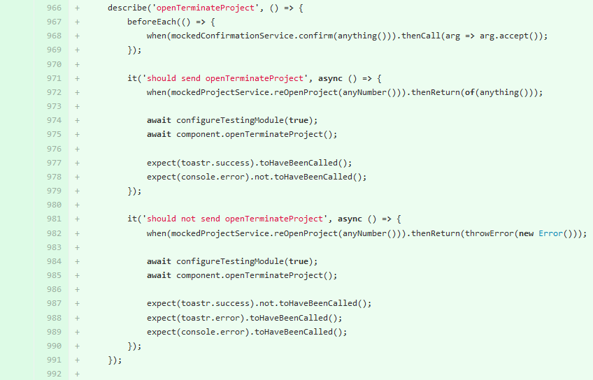

# [A 2.2] Maintenance corrective ou évolutive d'une solution applicative

---
## Analyse et correction d'un dysfonctionnement

---
### Stage chez Fime
**Projet :** 2

**Mission :** 2 (Frontend et Backend)

**Objectif :** modification d'un formulaire

#### <u>Frontend</u> :
<u>Contexte</u> :

- Modification d'un formulaire en ajoutant un nouveau champ
(adresse de l'entreprise) 
- Fusion de deux autres champs en un (prénom et nom)
- Ajout des messages de validation pour les nouveaux champs en
cas d'erreur
- Ajout d'une fonction qui va préparer le format d'affichage pour
l'adresse de l'entreprise.

#### <u>Backend</u> :
<u>Dysfonctionnement repéré 1</u> :
- Suite à des tests d'un développeur pour la création d'un template,
nous avons vu que le prénom et le nom étaient toujours séparés.

<u>Correction 1</u> :
- Modification de toutes les informations qui concernent le prénom et le nom
dans le backend

<u>Dysfonctionnement repéré 2</u> :

- Dans le champ qui affiche normalement l'adresse de l'entreprise,
c'est le nom de l'entreprise qui s'affiche.

<u>Correction 2</u> :

- Identification de l'adresse de l'entreprise dans le backend
- Renvoi sous forme de liste JSON dans le frontend

<u>Dysfonctionnement repéré 3</u> :
- L'objet avait quatre entrées pour ranger les données de
l'adresse de l'entreprise, mais la liste pourrait être plus grande que
quatre.

<u>Correction 3</u> :

- Modification du renvoi de l'adresse de l'entreprise
- L'objet a désormais une entrée qui contient une liste
sans aucune limite de taille. 
- Ajout de l'adresse de l'entreprise dans tous les templates

**Projet :** 2

**Mission :** 3 (Frontend)

**Objectif :** Ajouter une nouvelle itération dans un projet fermé
grâce à un nouveau bouton

#### <u>Frontend</u> :
<u>Contexte</u> : 
- Le projet peut contenir une liste de projets dont chaque projet peut
contenir une ou plusieurs itérations. 
- L'objectif est de pouvoir ajouter une nouvelle itération 
dans un projet fermé. 
- Je dois ajouter un bouton qui permet de changer le statut 
du projet pour qu'il ne soit plus fermé et ajouter une nouvelle itération.
- J'ai ajouté des restrictions pour pouvoir faire afficher le bouton
de réouverture du projet pour être sûr de ne pas y avoir accès
si le projet est ouvert.

<u>Dysfonctionnement repéré 1</u> : 

- Quand on appuie sur le bouton de réouverture du projet, le bouton de fermeture
du projet réapparaît pendant un lapse de temps avant de disparaître
à nouveau. 

<u>Correction 1</u> :
- Ajout d'une variable booléenne globale qui est définie
sur false de base pour savoir si le projet est rouvert. 
- La variable globale est mise à jour à chaque fois que
l'utilisateur appuie sur le bouton pour fermer ou pour rouvrir le projet.
- Dans le système qui restreint l'affichage du bouton de fermeture,
ajout d'une nouvelle fonction qui vérifie bien que la variable globale
est false.

<u>Dysfonctionnement repéré 2</u> :
- Le projet ne pouvait pas être rouvert deux fois de suite car le bouton
de fermeture ne s'affichait pas sur le deuxième essai.

<u>Correction 2</u> :

- Ajout de la variable booléenne globale qui est définie sur false
à la fin de la fonction de réouverture. 
- J'ai par la suite découvert que le bouton de réouverture ne s'affichait 
pas quand l'une itération avait été rejetée et que le projet avait été fermé.
- Ajout d'une autorisation pour que le bouton s'affiche 
si l'itération est rejetée.

**Projet :** 2

**Mission :** 5 (Frontend et Backend)

**Objectif :** Ajouter le nom de l'entreprise lors d'un commentaire

#### <u>Frontend</u> :
<u>Contexte</u> :

- J'ai ajouté le nom de l'entreprise derrière le prénom de la personne
qui envoie un commentaire.

<u>Dysfonctionnement repéré 1</u> :
- Le nom de l'entreprise s'affichait en lien avec le projet 
et non avec l'utilisateur. 

<u>Correction 1</u> :
- Ajout d'une vérification qui trie tous les utilisateurs en fonction
du prénom et du nom. Il fait correspondre l'auteur du commentaire
au nom de l'entreprise et l'affiche.

<u>Correction 2</u> :
- Ajout du nom de l'entreprise dans le modèle du commentaire.
- Suppression de la fonctionnalité précédente qui est obsolète.

#### <u>Backend</u> :
<u>Dysfonctionnement repéré 2</u> :

- La méthode de vérification que j'avais créée dans le frontend était 
trop lourde. Il pouvait y avoir aussi des problèmes d'identité. 
Le commentaire pouvait s'afficher plusieurs fois si des utilisateurs 
avaient le même nom.

<u>Correction 2</u> :

- Modification de l'objet des commentaires pour retourner en plus le nom de
l'entreprise de l'utilisateur. 

---
## Élaboration et réalisation de tests des éléments mis à jour

---
### Stage chez Fime
Lors de mon stage, après chaque évolution apportée au projet, j'ai réalisé
des tests pour vérifier que ces nouvelles fonctionnalités n'avaient
pas d'erreur.

Les tests sont effectués avec Pipeline, un outil qui permet de réaliser
automatiquement des tests unitaires.
Malheureusement Pipeline ne marchait pas correctement en locale
sur ma machine.
J'ai donc fait les tests avec Pipeline dans l'espace (Gitlab) où est stocké
le projet. Pipeline est intégré par défaut dans chaque repository (projet)
de l'entreprise.
Chaque branche est reliée à un pull request.
À chaque fois qu'une branche est mise à jour, Pipeline fait les tests
automatiquement :

- Build
- Test
- Deploy
- Production

Cela permet de faire une intégration continue
des différentes versions d'une solution applicative.

Exemples de Tests

La fonction `describe()` sert à regrouper les différents tests (`it()`)
de la fonction `isProjectReOpened`.

- Le premier test doit retourner `true` si
  `component.projectReOpened = true`.
- Le second test doit retourner `false` si
  `component.projectReOpened = false`.

La fonction `describe()` sert à regrouper les différents tests (`it()`)

- Le premier test doit retourner `true`
    - si le projet est `CERTIFICATION` et si le statut est `TERMINATED`
    - si la dernière iteration est `TERMINATED` et si le statut des tests
      sont `VALIDATED`.
- Le second test doit retourner `false`
    - si dans la dernière iteration le statut des tests sont `REJECTED`.
- Le troisième test doit retourner `false`
    - si le statut du projet est `ACTIVE`.

La fonction `describe()` sert à regrouper les différents tests (`it()`)

- Le premier test doit retourner la fonction `openTerminateProject`
    - si cela fonctionne.
- Le premier test ne doit pas retourner la fonction `openTerminateProject`
    - si cela ne fonctionne pas.
