# [C 2.1.(1.2.3)] Analyse, conception

---
## Analyse d'un besoin exprimé et de son contexte juridique

---
### Refonte Site Artiste
J'ai, en première année de BTS SIO, amélioré le [site](https://www.mratel.fr/)
de Michèle Ratel.

#### Finalités du site de l'artiste
L'objectif principal de ce site est de promouvoir les œuvres d'une artiste
et de faire découvrir son histoire personnelle. L'un des objectifs 
complémentaires est de communiquer sur ses expositions à venir.
Il est également important de rendre accessible son atelier, ouvert à 
la visite et de rendre visible les œuvres de l'artiste, disponibles à 
la vente. Les utilisateurs du site pourront suivre l'artiste grâce à 
ses actualités. Ils pourront enfin contacter l'artiste par le biais 
d'un formulaire de contact et lui laisser un commentaire qui s'ajoutera 
dans le livre d'or après validation de l'artiste.

#### Etude du site de l'artiste avant refonte
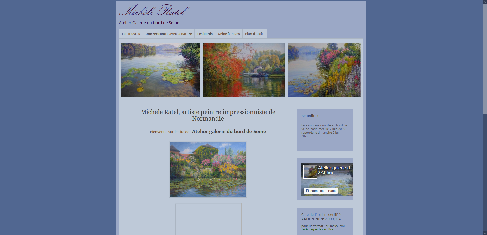

<u>Atouts</u> :
Le site dispose de contenus complets et de qualité.

<u>Inconvénients</u> :

- La structuration dans les différents onglets du menu
- La charte graphique, pas assez moderne
- Les RGPD et mentions légales (qui ne sont pas présents)
- Le formulaire de contact pas assez visible (dans le livre d'or)
- Pas de captcha
- Le site ne semble pas à jour car le copyright est de 2017

### CRM
Madame JPF, sophrologue, n'est pas informatisée et elle
réalise tous ses documents à la main.
J'ai essayé de lui proposer un logiciel pour l'aider à gérer son activité.

La cliente souhaitait un logiciel facile d'utilisation, gratuit,
qui lui permettrait de gérer ses contacts et l'emplacement
des documents de ses patients pour mieux les retrouver.
Elle souhaitait également établir des factures en toute simplicité.

J'ai donc réalisé une étude des besoins de la cliente
et des différents logiciels.

Cela m'a permis de choisir un CRM adapté aux besoins de ma cliente : 
Agile CRM.

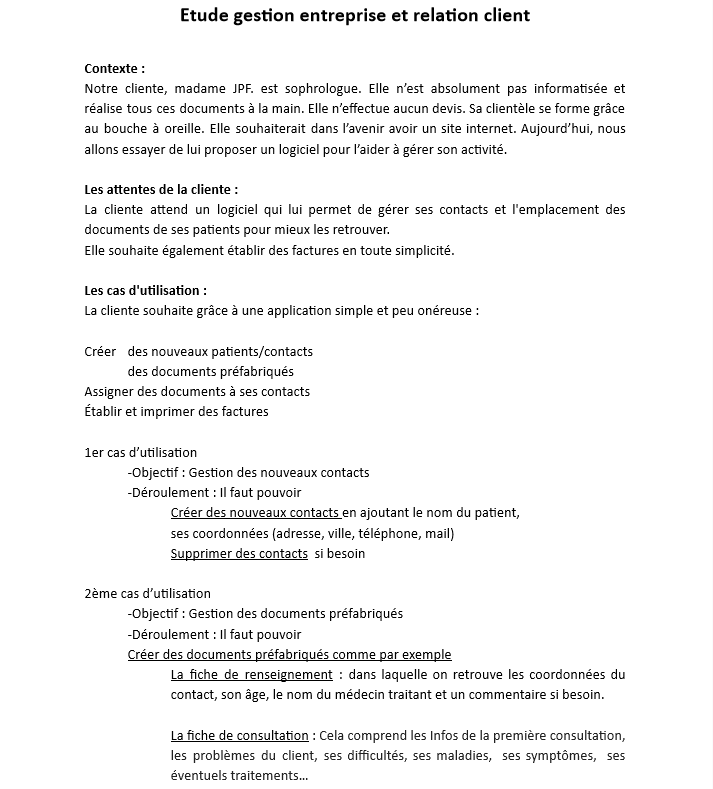
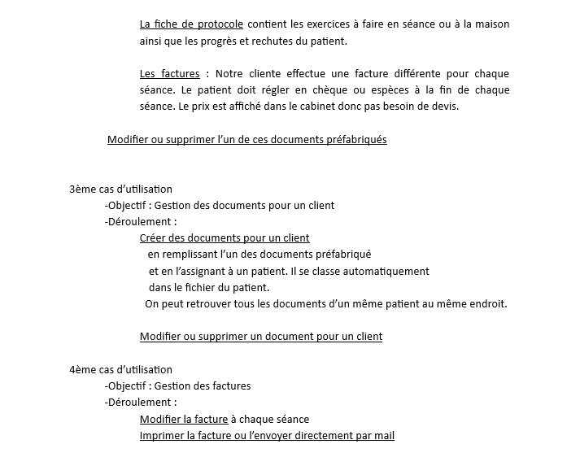
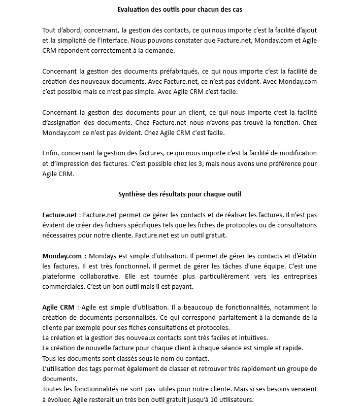
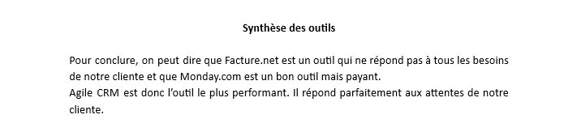
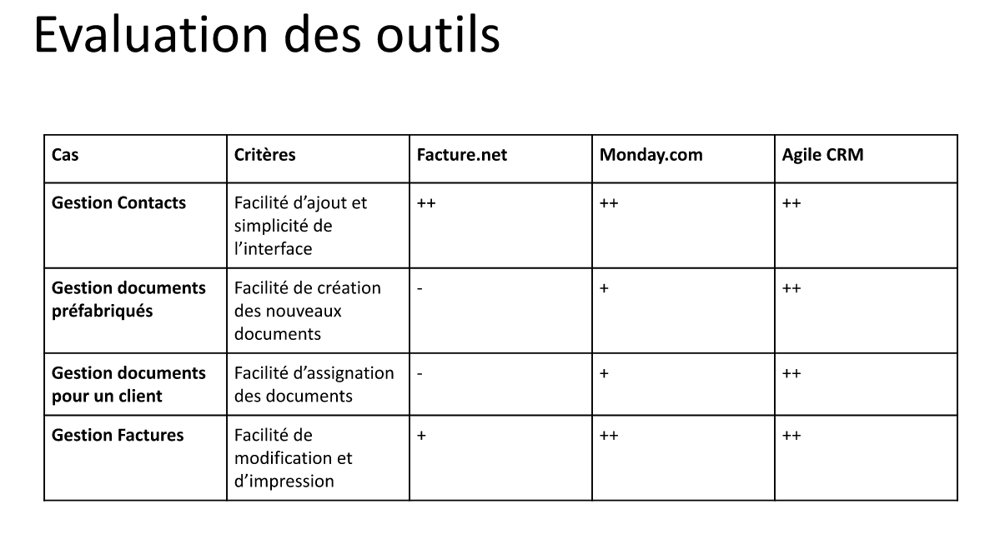

---
## Participation à la conception de l'architecture d'une solution applicative

---
### Proxmox-admin
Lors de la conception du projet de groupe, nous nous sommes mis d'accord sur
les différents onglets en tenant compte des besoins spécifiques de 
l'application. 

### Multi-timer
Lors de la conception du projet de groupe, nous nous sommes mis d'accord sur
les différents onglets en tenant compte des besoins spécifiques de 
l'application.

### E-music
Lors de la conception du projet de groupe, 
chacun a modifié l'architecture de l'application en fonction de ses besoins. 
Il faudrait harmoniser l'ensemble.

---
## Modélisation d'une solution applicative

---
### Refonte Site Artiste
J'ai réalisé ce projet sous **WordPress**, en utilisant comme thème : 
**NatureSpace** et comme plugins : **WPForms Lite** et **Envira Gallery**.

<u>Aspects esthétiques</u> :
- Thème choisi : NatureSpace. Ce thème est en adéquation avec la nature, 
thème développé par l'artiste dans ses peintures.

<u>Aspects ergonomiques et structurels</u> :

J'ai fait en sorte que la barre de navigation suive sur toutes les pages.
J'ai réagencé les pages afin de faciliter la navigation du visiteur et lui
permettre de trouver plus rapidement ce qu'il cherche.

- Menu de navigation :
  - Accueil
  - Biographie
  - Galerie
    - Tableaux réalisés
    - Tableaux exposés
  - Atelier
  - Actualités
  - Contact

- Accueil : Réalisation d'une page originale illustrée avec des peintures
de l'artiste.

- Biographie : Mise en place d'une photo de l'artiste.

- Galerie : Mise en avant de toutes ses peintures avec leurs formats si
disponibles.

- Atelier : Ajout d'une carte ainsi que des photos de l'atelier et
des trois salles d'expositions.

- Actualités : Mise en place d'une page de d'actualité modifiable pour
l'artiste grâce à des articles. Grâce au document client, Michèle Ratel
peut facilement mettre à jour son site et ses événements.

- Contact : Mise en place d'un formulaire de contact avec un captcha.
Ajout d'un lien facebook afin qu'il soit visible sur chaque page,
ainsi que le RGPD en bas de page.

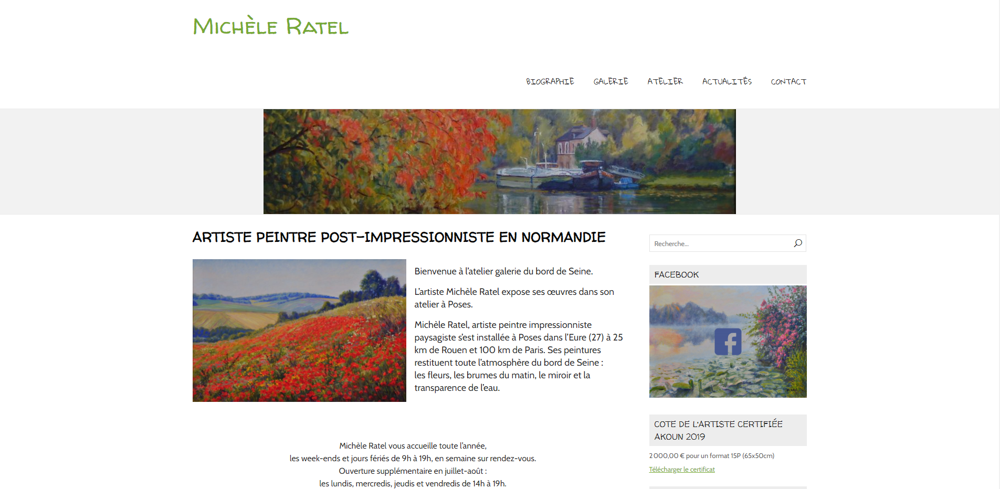

### Portfolio
J'ai fait le choix d'Ubiquity pour la mise en place du site.
J'ai réalisé une maquette papier du header afin de visualiser 
tous les onglets nécessaires à la réalisation de mon portfolio tout 
en respectant le cahier des charges. 

Header : Accueil / A Propos / Parcours / Projets / Tableau de Synthèse / 
Contact

Pour la première page, j'ai choisi une photo accompagnée d'une animation 
de pluie de particules. 

J'ai choisi Semantic pour l'interface UI. 

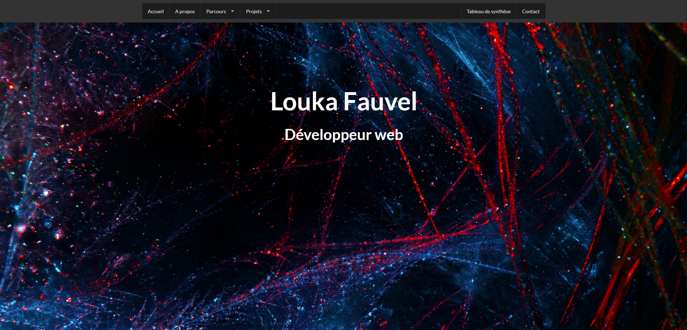

### Proxmox-admin
Nous avons maquetté le projet avant de le commencer en définissant :
- la palette de couleur
- le choix du logo
- la forme des différents blocs, boutons... 

Version 2

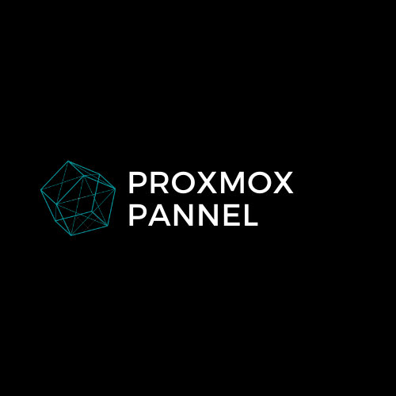

Version 3

Version 4

Version 7 (Logo choisi)

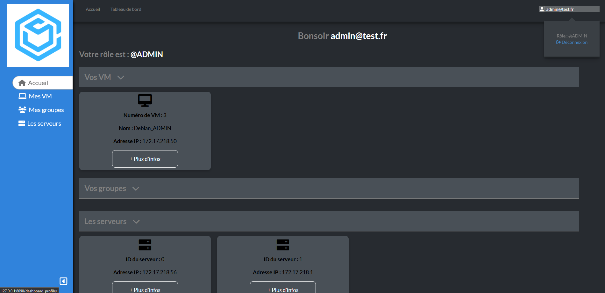

Version 1

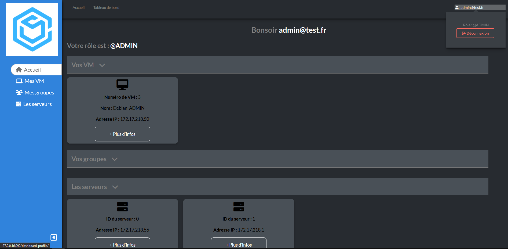

Version 2 (Bouton de déconnexion choisi)

### Multi-timer
Nous avons maquetté le projet avant de le commencer en définissant :
- la palette de couleur
- le choix du logo

Version 1

Ou

Version 2 (Logos choisi)

### E-music
Lors de la conception du projet de groupe,
nous avons fait le choix d'un thème sombre.
Nous avons ensuite travaillé chacun de notre côté sur nos différentes
missions sans définir préalablement une charte graphique.
Il faudrait harmoniser l'ensemble.

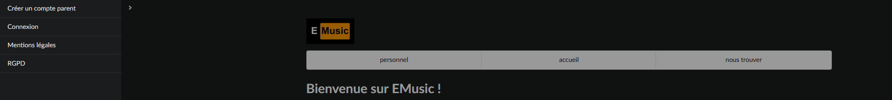

Architecture de la sidebar et du header.