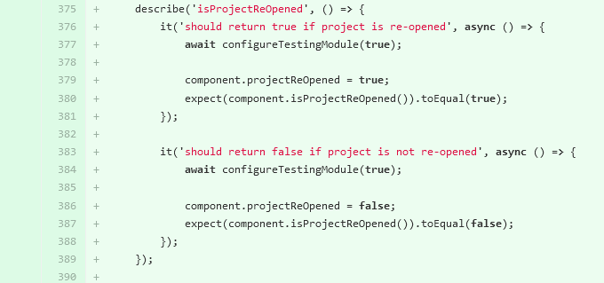
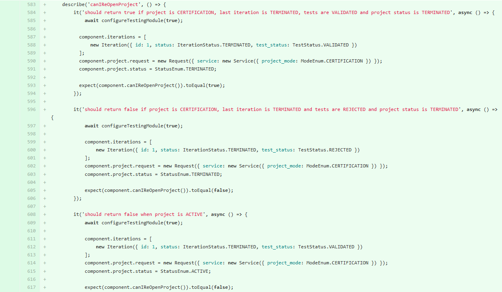

# [C 2.1.(8.9.11)] Tests, intégration continue

---
## Réalisation des tests nécessaires à la validation ou à la mise en production d’éléments adaptés ou développés
## Intégration continue des versions d’une solution applicative

---
### Stage chez Fime

Lors de mon stage, après chaque évolution apportée au projet, j'ai réalisé 
des tests pour vérifier que ces nouvelles fonctionnalités n'avaient 
pas d'erreur.

Les tests sont effectués avec Pipeline, un outil qui permet de réaliser 
automatiquement des tests unitaires. 
Malheureusement Pipeline ne marchait pas correctement en locale 
sur ma machine.
J'ai donc fait les tests avec Pipeline dans l'espace (Gitlab) où est stocké 
le projet. Pipeline est intégré par défaut dans chaque repository (projet) 
de l'entreprise. 
Chaque branche est reliée à un pull request.
À chaque fois qu'une branche est mise à jour, Pipeline fait les tests
automatiquement : 

- Build
- Test
- Deploy
- Production

Cela permet de faire une intégration continue 
des différentes versions d'une solution applicative. 

Exemples de Tests

La fonction `describe()` sert à regrouper les différents tests (`it()`)
de la fonction `isProjectReOpened`.

- Le premier test doit retourner `true` si
  `component.projectReOpened = true`.
- Le second test doit retourner `false` si
  `component.projectReOpened = false`.

La fonction `describe()` sert à regrouper les différents tests (`it()`)

- Le premier test doit retourner `true`
    - si le projet est `CERTIFICATION` et si le statut est `TERMINATED`
    - si la dernière iteration est `TERMINATED` et si le statut des tests
      sont `VALIDATED`.
- Le second test doit retourner `false`
    - si dans la dernière iteration le statut des tests sont `REJECTED`.
- Le troisième test doit retourner `false`
    - si le statut du projet est `ACTIVE`.

La fonction `describe()` sert à regrouper les différents tests (`it()`)

- Le premier test doit retourner la fonction `openTerminateProject`
    - si cela fonctionne.
- Le premier test ne doit pas retourner la fonction `openTerminateProject`
    - si cela ne fonctionne pas.

### E-music

Sur le projet E-music, j'ai commencé à réaliser des tests d'intégration
avec Mockito (framework de test open source pour Java) et SpringBootTest.
Mes tests ne sont malheureusement pas encore très concluants. 