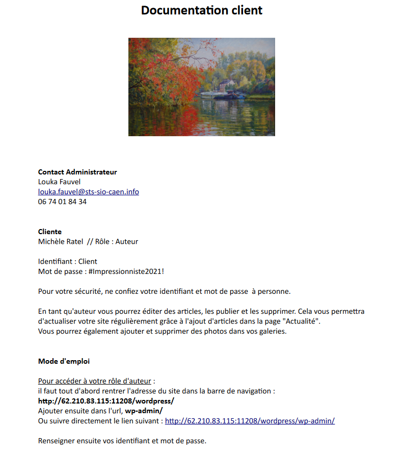
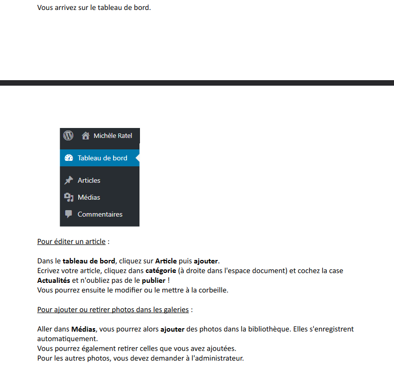
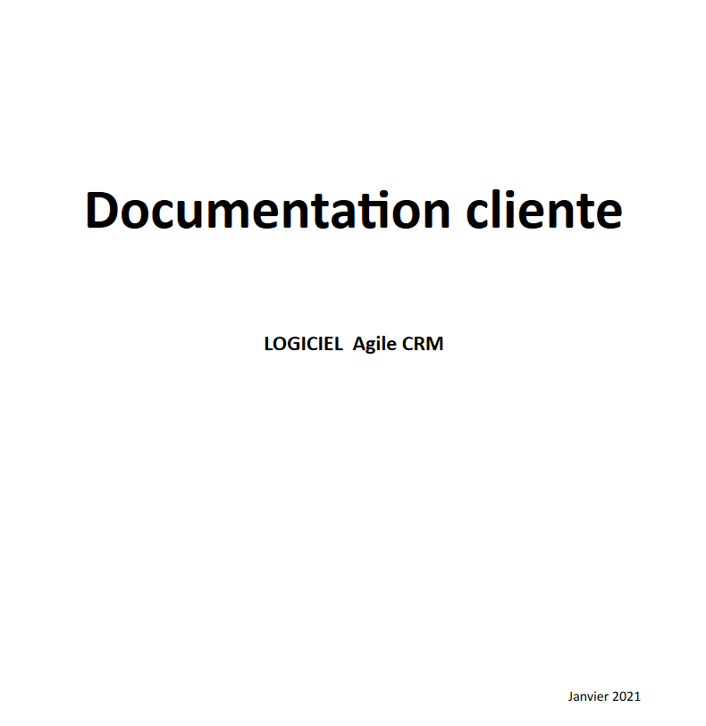
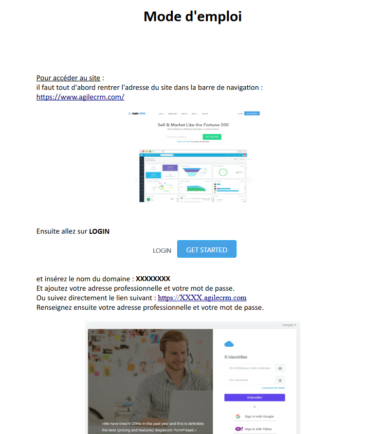
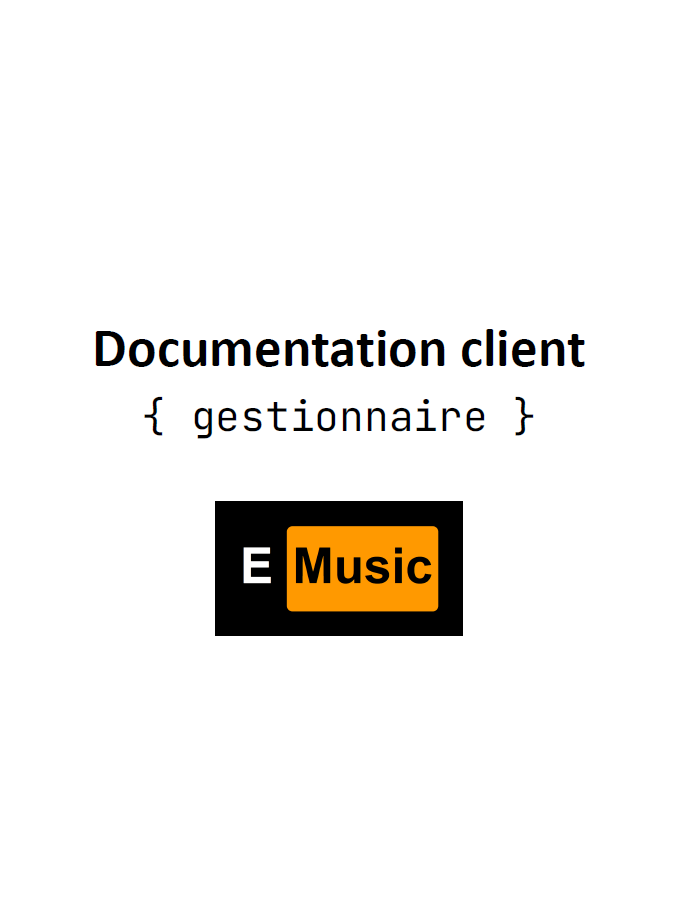
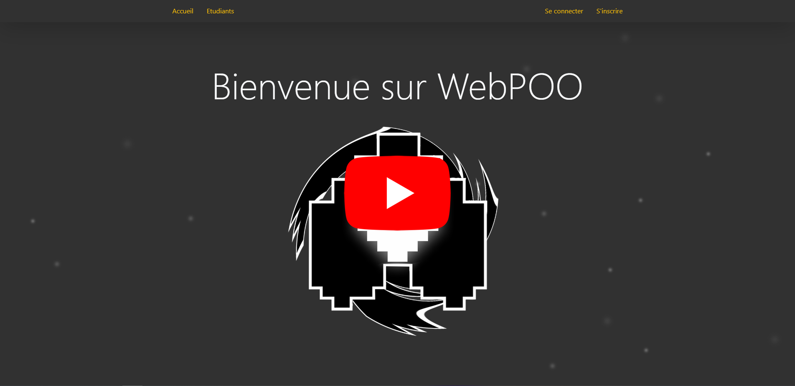
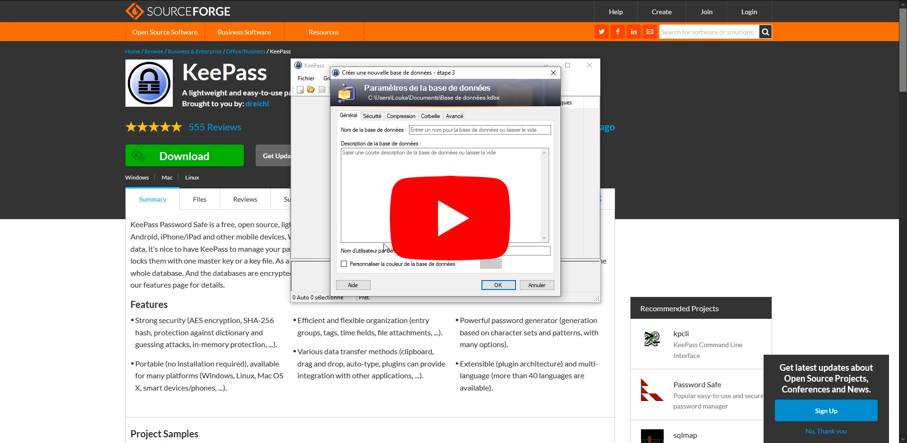

# [C 2.1.10] Conception de documentation

---
## Rédaction des documentations techniques et d’utilisation d’une solution applicative

---
### Refonte-Site-Artiste

Réalisation d'une [documentation](https://github.com/Louka-Fauvel/Refonte-Site-Artiste/blob/master/document/Documentation%20Client.pdf) 
pour faciliter la navigation et l'utilisation du site par l'artiste.

Elle contient :
- les contacts administrateur et cliente
- chaque contexte d'utilisation de l'application :
  - pour accéder au site
  - pour accéder au tableau de bord
  - pour éditer un article
  - pour ajouter ou retirer des photos dans les galeries

### CRM

Réalisation d'une [documentation](http://www.louka-fauvel.fr/assets/doc/Documentation_Client.pdf) 
de 9 pages pour faciliter l'expérience utilisateur de la cliente.

Elle contient :
- les contacts administrateur et cliente
- chaque contexte d'utilisation de l'application :
  - pour accéder au site
  - pour créer ou supprimer un contact
  - pour créer ou document préfabriqué
  - pour créer ou supprimer un document pour un client
  - pour imprimer une facture

Extrait de la documentation client.

### E-music

Réalisation d'une [documentation](https://github.com/PaulG0/E-Music/blob/test/suivi/Documentation_client_gestionnaire.pdf)
de 22 pages pour guider le gestionnaire lors de son utilisation de 
l'application.

Elle contient :
- les contacts et identifiant
- connexion
- Consultation de la liste des membres
- Gestion de compte
- Gestion des cours
- Gestion des factures et des paiements
- Déconnexion

Couverture de la documentation client (gestionnaire)

### WebPOO

Réalisation d'un [tuto vidéo](https://www.youtube.com/watch?v=LMfGrRpgTtk) 
pour améliorer l'expérience utilisateur des étudiants.

### Tutorial KeePass

Réalisation d'un [tuto vidéo](https://www.youtube.com/watch?v=pJ5LMMZXM0s)
pour expliquer l'utilisation de l'application KeePass.

