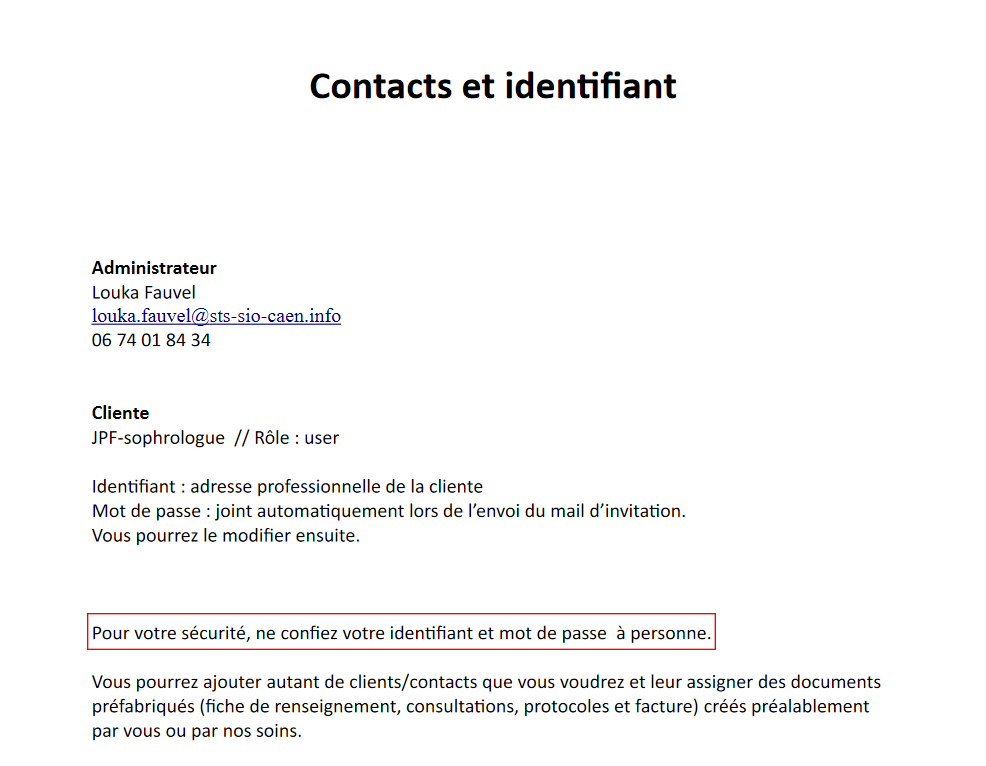

# [A 3.1] Protéger les données à caractère personnel

---
## Appliquer la réglementation en matière de collecte, de traitement et de conservation des données à caractère personnel

---

### Réalisation d'une charte informatique accessible aux utilisateurs directement sur les sites pour protéger les données à caractère personnel conformément à la réglementation en vigueur.

#### Siteperso2

#### Portfolio

### Réalisation d'une charte informatique pour protéger les données à caractère personnel et rédaction des mentions légales.

#### Proxmox-admin

#### E-music

Mentions légales

RGPD

---
## Sensibiliser les utilisateurs à la protection des données à caractère personnel

---

Ajout d'une phrase dans les documentations clients afin de sensibiliser les
utilisateurs à la protection de leurs données à caractère personnel.

### Refonte Site

### CRM

### E-music

